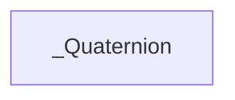

| public |
{:.api_label}

#### Inheritance Graph

## Description

Class used to represent a rotation as a quaternion.

**Author**: Benjamin Eikel

**Date**: 2009-12-13

## Rotation

|
| ------: | ----------------- |
|  | |
| void | **[makeRotate](#classGeometry_1_1%5F%5FQuaternion_1a70d865ac29d4612a70aebf055fbccc6c)**(const [angle_t](classGeometry_1_1%5F%5FQuaternion#classGeometry_1_1%5F%5FQuaternion_1ae19e32a591204561d8588132ff22c6e3) & angle,  [value_t](classGeometry_1_1%5F%5FQuaternion#classGeometry_1_1%5F%5FQuaternion_1a9b9922d22cb06e957e345f5a8a609892)  _x,  [value_t](classGeometry_1_1%5F%5FQuaternion#classGeometry_1_1%5F%5FQuaternion_1a9b9922d22cb06e957e345f5a8a609892)  _y,  [value_t](classGeometry_1_1%5F%5FQuaternion#classGeometry_1_1%5F%5FQuaternion_1a9b9922d22cb06e957e345f5a8a609892)  _z) |
|  | |
| void | **[makeRotate](#classGeometry_1_1%5F%5FQuaternion_1a3d3ba96ab770608fe309dfdcac7fc8e3)**(const [angle_t](classGeometry_1_1%5F%5FQuaternion#classGeometry_1_1%5F%5FQuaternion_1ae19e32a591204561d8588132ff22c6e3) & angle, const [vec3_t](classGeometry_1_1%5F%5FQuaternion#classGeometry_1_1%5F%5FQuaternion_1ad979e45c5c1a09450b9c86a9d799ed64) & axis) |
|  | |
| void | **[makeRotate_deg](#classGeometry_1_1%5F%5FQuaternion_1ad2e66bfa3a40a1bd85ea5fd323b8a967)**( [value_t](classGeometry_1_1%5F%5FQuaternion#classGeometry_1_1%5F%5FQuaternion_1a9b9922d22cb06e957e345f5a8a609892)  deg,  [value_t](classGeometry_1_1%5F%5FQuaternion#classGeometry_1_1%5F%5FQuaternion_1a9b9922d22cb06e957e345f5a8a609892)  _x,  [value_t](classGeometry_1_1%5F%5FQuaternion#classGeometry_1_1%5F%5FQuaternion_1a9b9922d22cb06e957e345f5a8a609892)  _y,  [value_t](classGeometry_1_1%5F%5FQuaternion#classGeometry_1_1%5F%5FQuaternion_1a9b9922d22cb06e957e345f5a8a609892)  _z) |
|  | |
| void | **[makeRotate_deg](#classGeometry_1_1%5F%5FQuaternion_1a5c910873e5536e36c47779b04e6b8878)**( [value_t](classGeometry_1_1%5F%5FQuaternion#classGeometry_1_1%5F%5FQuaternion_1a9b9922d22cb06e957e345f5a8a609892)  deg, const [vec3_t](classGeometry_1_1%5F%5FQuaternion#classGeometry_1_1%5F%5FQuaternion_1ad979e45c5c1a09450b9c86a9d799ed64) & axis) |
|  | |
| void | **[makeRotate_rad](#classGeometry_1_1%5F%5FQuaternion_1a16a7f56757cbf8d6012dc41e466c272b)**( [value_t](classGeometry_1_1%5F%5FQuaternion#classGeometry_1_1%5F%5FQuaternion_1a9b9922d22cb06e957e345f5a8a609892)  rad,  [value_t](classGeometry_1_1%5F%5FQuaternion#classGeometry_1_1%5F%5FQuaternion_1a9b9922d22cb06e957e345f5a8a609892)  _x,  [value_t](classGeometry_1_1%5F%5FQuaternion#classGeometry_1_1%5F%5FQuaternion_1a9b9922d22cb06e957e345f5a8a609892)  _y,  [value_t](classGeometry_1_1%5F%5FQuaternion#classGeometry_1_1%5F%5FQuaternion_1a9b9922d22cb06e957e345f5a8a609892)  _z) |
|  | |
| void | **[makeRotate_rad](#classGeometry_1_1%5F%5FQuaternion_1af71850bbabc4b415c15d2c6b4173bff3)**( [value_t](classGeometry_1_1%5F%5FQuaternion#classGeometry_1_1%5F%5FQuaternion_1a9b9922d22cb06e957e345f5a8a609892)  rad, const [vec3_t](classGeometry_1_1%5F%5FQuaternion#classGeometry_1_1%5F%5FQuaternion_1ad979e45c5c1a09450b9c86a9d799ed64) & axis) |
|  | |
|  | **[_Quaternion](#classGeometry_1_1%5F%5FQuaternion_1a92add5c95dc605bf26659665b689642e)**(const [angle_t](classGeometry_1_1%5F%5FQuaternion#classGeometry_1_1%5F%5FQuaternion_1ae19e32a591204561d8588132ff22c6e3) & rotX, const [angle_t](classGeometry_1_1%5F%5FQuaternion#classGeometry_1_1%5F%5FQuaternion_1ae19e32a591204561d8588132ff22c6e3) & rotY, const [angle_t](classGeometry_1_1%5F%5FQuaternion#classGeometry_1_1%5F%5FQuaternion_1ae19e32a591204561d8588132ff22c6e3) & rotZ) |
{: .nohead .nowrap1 .api_section }

## Serialization

|
| ------: | ----------------- |
| |
| |
{: .nohead .nowrap1 .api_section }

## Public Types

|
| ------: | ----------------- |
|  | |
| typedef T | **[value_t](#classGeometry_1_1%5F%5FQuaternion_1a9b9922d22cb06e957e345f5a8a609892)**  |
|  | |
| typedef [_Angle](classGeometry_1_1%5F%5FAngle) < [value_t](classGeometry_1_1%5F%5FQuaternion#classGeometry_1_1%5F%5FQuaternion_1a9b9922d22cb06e957e345f5a8a609892) > | **[angle_t](#classGeometry_1_1%5F%5FQuaternion_1ae19e32a591204561d8588132ff22c6e3)**  |
|  | |
| typedef [_Vec3](classGeometry_1_1%5F%5FVec3) < [value_t](classGeometry_1_1%5F%5FQuaternion#classGeometry_1_1%5F%5FQuaternion_1a9b9922d22cb06e957e345f5a8a609892) > | **[vec3_t](#classGeometry_1_1%5F%5FQuaternion_1ad979e45c5c1a09450b9c86a9d799ed64)**  |
|  | |
| typedef [_Quaternion](classGeometry_1_1%5F%5FQuaternion) < [value_t](classGeometry_1_1%5F%5FQuaternion#classGeometry_1_1%5F%5FQuaternion_1a9b9922d22cb06e957e345f5a8a609892) > | **[quaternion_t](#classGeometry_1_1%5F%5FQuaternion_1a650dadaf12051a78a1fc8d50cb69218b)**  |
|  | |
| typedef [_Matrix3x3](classGeometry_1_1%5F%5FMatrix3x3) < [value_t](classGeometry_1_1%5F%5FQuaternion#classGeometry_1_1%5F%5FQuaternion_1a9b9922d22cb06e957e345f5a8a609892) > | **[matrix3x3_t](#classGeometry_1_1%5F%5FQuaternion_1a1a3ce2f1a15bcaa2d08f030a1760b5bb)**  |
{: .nohead .nowrap1 .api_section }

## Public Functions

|
| ------: | ----------------- |
|  | |
|  | **[_Quaternion](#classGeometry_1_1%5F%5FQuaternion_1a3e3f2bcbf46d4e60a5e730d3b389225d)**() |
|  | |
|  | **[_Quaternion](#classGeometry_1_1%5F%5FQuaternion_1a9c73cc0039e2339dfbed62067ca19cb2)**( [value_t](classGeometry_1_1%5F%5FQuaternion#classGeometry_1_1%5F%5FQuaternion_1a9b9922d22cb06e957e345f5a8a609892)  _x,  [value_t](classGeometry_1_1%5F%5FQuaternion#classGeometry_1_1%5F%5FQuaternion_1a9b9922d22cb06e957e345f5a8a609892)  _y,  [value_t](classGeometry_1_1%5F%5FQuaternion#classGeometry_1_1%5F%5FQuaternion_1a9b9922d22cb06e957e345f5a8a609892)  _z,  [value_t](classGeometry_1_1%5F%5FQuaternion#classGeometry_1_1%5F%5FQuaternion_1a9b9922d22cb06e957e345f5a8a609892)  _w) |
|  | |
|  | **[_Quaternion](#classGeometry_1_1%5F%5FQuaternion_1ab8e8414a25c271e0499b3d061ee941e3)**(const [value_t](classGeometry_1_1%5F%5FQuaternion#classGeometry_1_1%5F%5FQuaternion_1a9b9922d22cb06e957e345f5a8a609892) * v) |
|  | |
| bool | **[operator==](#classGeometry_1_1%5F%5FQuaternion_1a0cbb0b1135b2cdaefc6a5299dd0ee1fd)**(const [quaternion_t](classGeometry_1_1%5F%5FQuaternion#classGeometry_1_1%5F%5FQuaternion_1a650dadaf12051a78a1fc8d50cb69218b) & other) const |
|  | |
| bool | **[operator!=](#classGeometry_1_1%5F%5FQuaternion_1a60d81ddc6c5bf4bb40e0dd9f6e93d811)**(const [quaternion_t](classGeometry_1_1%5F%5FQuaternion#classGeometry_1_1%5F%5FQuaternion_1a650dadaf12051a78a1fc8d50cb69218b) & other) const |
|  | |
| void | **[set](#classGeometry_1_1%5F%5FQuaternion_1a54a5f3fa727037c82a424fa23f34ebe4)**( [value_t](classGeometry_1_1%5F%5FQuaternion#classGeometry_1_1%5F%5FQuaternion_1a9b9922d22cb06e957e345f5a8a609892)  _x,  [value_t](classGeometry_1_1%5F%5FQuaternion#classGeometry_1_1%5F%5FQuaternion_1a9b9922d22cb06e957e345f5a8a609892)  _y,  [value_t](classGeometry_1_1%5F%5FQuaternion#classGeometry_1_1%5F%5FQuaternion_1a9b9922d22cb06e957e345f5a8a609892)  _z,  [value_t](classGeometry_1_1%5F%5FQuaternion#classGeometry_1_1%5F%5FQuaternion_1a9b9922d22cb06e957e345f5a8a609892)  _w) |
|  | |
| [value_t](classGeometry_1_1%5F%5FQuaternion#classGeometry_1_1%5F%5FQuaternion_1a9b9922d22cb06e957e345f5a8a609892) & | **[operator[]](#classGeometry_1_1%5F%5FQuaternion_1a73332cf7407d087c8393539b93dfaf01)**(int i) |
|  | |
| [value_t](classGeometry_1_1%5F%5FQuaternion#classGeometry_1_1%5F%5FQuaternion_1a9b9922d22cb06e957e345f5a8a609892) | **[operator[]](#classGeometry_1_1%5F%5FQuaternion_1a78d7b5ef24b30737524d68a78984275f)**(int i) const |
|  | |
| [value_t](classGeometry_1_1%5F%5FQuaternion#classGeometry_1_1%5F%5FQuaternion_1a9b9922d22cb06e957e345f5a8a609892) & | **[x](#classGeometry_1_1%5F%5FQuaternion_1a7544d8427f435b81f1d34f477a7bb58b)**() |
|  | |
| [value_t](classGeometry_1_1%5F%5FQuaternion#classGeometry_1_1%5F%5FQuaternion_1a9b9922d22cb06e957e345f5a8a609892) & | **[y](#classGeometry_1_1%5F%5FQuaternion_1a7976b89664d3b2ea635ad51d5f40d56c)**() |
|  | |
| [value_t](classGeometry_1_1%5F%5FQuaternion#classGeometry_1_1%5F%5FQuaternion_1a9b9922d22cb06e957e345f5a8a609892) & | **[z](#classGeometry_1_1%5F%5FQuaternion_1a7980d4c2827468829393f5e507225228)**() |
|  | |
| [value_t](classGeometry_1_1%5F%5FQuaternion#classGeometry_1_1%5F%5FQuaternion_1a9b9922d22cb06e957e345f5a8a609892) & | **[w](#classGeometry_1_1%5F%5FQuaternion_1ade1bc069dc116b29161b80edb543a516)**() |
|  | |
| [value_t](classGeometry_1_1%5F%5FQuaternion#classGeometry_1_1%5F%5FQuaternion_1a9b9922d22cb06e957e345f5a8a609892) | **[x](#classGeometry_1_1%5F%5FQuaternion_1a6cbffeb24aaf9690602e2f128627274e)**() const |
|  | |
| [value_t](classGeometry_1_1%5F%5FQuaternion#classGeometry_1_1%5F%5FQuaternion_1a9b9922d22cb06e957e345f5a8a609892) | **[y](#classGeometry_1_1%5F%5FQuaternion_1a7b8f5f0d6d34d98a84fba2f227a004fd)**() const |
|  | |
| [value_t](classGeometry_1_1%5F%5FQuaternion#classGeometry_1_1%5F%5FQuaternion_1a9b9922d22cb06e957e345f5a8a609892) | **[z](#classGeometry_1_1%5F%5FQuaternion_1a17defe6bbe1d7884239085ea7c076e18)**() const |
|  | |
| [value_t](classGeometry_1_1%5F%5FQuaternion#classGeometry_1_1%5F%5FQuaternion_1a9b9922d22cb06e957e345f5a8a609892) | **[w](#classGeometry_1_1%5F%5FQuaternion_1aec97f55ec062052cf55b1003035a0423)**() const |
|  | |
| const [quaternion_t](classGeometry_1_1%5F%5FQuaternion#classGeometry_1_1%5F%5FQuaternion_1a650dadaf12051a78a1fc8d50cb69218b) | **[operator*](#classGeometry_1_1%5F%5FQuaternion_1acd099dc403d097520b65221e46ac5c11)**( [value_t](classGeometry_1_1%5F%5FQuaternion#classGeometry_1_1%5F%5FQuaternion_1a9b9922d22cb06e957e345f5a8a609892)  factor) const |
|  | |
| [quaternion_t](classGeometry_1_1%5F%5FQuaternion#classGeometry_1_1%5F%5FQuaternion_1a650dadaf12051a78a1fc8d50cb69218b) & | **[operator*=](#classGeometry_1_1%5F%5FQuaternion_1a770d58afe3c5bbe4e52cc582d7abe342)**( [value_t](classGeometry_1_1%5F%5FQuaternion#classGeometry_1_1%5F%5FQuaternion_1a9b9922d22cb06e957e345f5a8a609892)  factor) |
|  | |
| const [quaternion_t](classGeometry_1_1%5F%5FQuaternion#classGeometry_1_1%5F%5FQuaternion_1a650dadaf12051a78a1fc8d50cb69218b) | **[operator/](#classGeometry_1_1%5F%5FQuaternion_1ad4c85cd82525c42cb019319eeb00e247)**( [value_t](classGeometry_1_1%5F%5FQuaternion#classGeometry_1_1%5F%5FQuaternion_1a9b9922d22cb06e957e345f5a8a609892)  divisor) const |
|  | |
| [quaternion_t](classGeometry_1_1%5F%5FQuaternion#classGeometry_1_1%5F%5FQuaternion_1a650dadaf12051a78a1fc8d50cb69218b) & | **[operator/=](#classGeometry_1_1%5F%5FQuaternion_1a80e99f93f87f271e8593605cf37c704c)**( [value_t](classGeometry_1_1%5F%5FQuaternion#classGeometry_1_1%5F%5FQuaternion_1a9b9922d22cb06e957e345f5a8a609892)  divisor) |
|  | |
| const [quaternion_t](classGeometry_1_1%5F%5FQuaternion#classGeometry_1_1%5F%5FQuaternion_1a650dadaf12051a78a1fc8d50cb69218b) | **[operator*](#classGeometry_1_1%5F%5FQuaternion_1a28f00db1d3370f774db5b624344182d3)**(const [quaternion_t](classGeometry_1_1%5F%5FQuaternion#classGeometry_1_1%5F%5FQuaternion_1a650dadaf12051a78a1fc8d50cb69218b) & q2) const |
|  | |
| [quaternion_t](classGeometry_1_1%5F%5FQuaternion#classGeometry_1_1%5F%5FQuaternion_1a650dadaf12051a78a1fc8d50cb69218b) | **[operator*=](#classGeometry_1_1%5F%5FQuaternion_1a6d3b3227bb8f686cc9baab439c624751)**(const [quaternion_t](classGeometry_1_1%5F%5FQuaternion#classGeometry_1_1%5F%5FQuaternion_1a650dadaf12051a78a1fc8d50cb69218b) & q2) |
|  | |
| const [quaternion_t](classGeometry_1_1%5F%5FQuaternion#classGeometry_1_1%5F%5FQuaternion_1a650dadaf12051a78a1fc8d50cb69218b) | **[operator/](#classGeometry_1_1%5F%5FQuaternion_1a94a99eacec60857b53a816a203558791)**(const [quaternion_t](classGeometry_1_1%5F%5FQuaternion#classGeometry_1_1%5F%5FQuaternion_1a650dadaf12051a78a1fc8d50cb69218b) & q2) const |
|  | |
| [quaternion_t](classGeometry_1_1%5F%5FQuaternion#classGeometry_1_1%5F%5FQuaternion_1a650dadaf12051a78a1fc8d50cb69218b) | **[operator/=](#classGeometry_1_1%5F%5FQuaternion_1a58e80de618ecc6d82c228a0943332040)**(const [quaternion_t](classGeometry_1_1%5F%5FQuaternion#classGeometry_1_1%5F%5FQuaternion_1a650dadaf12051a78a1fc8d50cb69218b) & q2) |
|  | |
| const [quaternion_t](classGeometry_1_1%5F%5FQuaternion#classGeometry_1_1%5F%5FQuaternion_1a650dadaf12051a78a1fc8d50cb69218b) | **[operator+](#classGeometry_1_1%5F%5FQuaternion_1a1a50b433feb34e2057eb5a75f4021259)**(const [quaternion_t](classGeometry_1_1%5F%5FQuaternion#classGeometry_1_1%5F%5FQuaternion_1a650dadaf12051a78a1fc8d50cb69218b) & source) const |
|  | |
| [quaternion_t](classGeometry_1_1%5F%5FQuaternion#classGeometry_1_1%5F%5FQuaternion_1a650dadaf12051a78a1fc8d50cb69218b) | **[operator+=](#classGeometry_1_1%5F%5FQuaternion_1a8d901f1a9462a2bb9a289bdba87b6f98)**(const [quaternion_t](classGeometry_1_1%5F%5FQuaternion#classGeometry_1_1%5F%5FQuaternion_1a650dadaf12051a78a1fc8d50cb69218b) & source) |
|  | |
| const [quaternion_t](classGeometry_1_1%5F%5FQuaternion#classGeometry_1_1%5F%5FQuaternion_1a650dadaf12051a78a1fc8d50cb69218b) | **[operator-](#classGeometry_1_1%5F%5FQuaternion_1ad4b15786445244c73a61c13fcfe6b0ab)**(const [quaternion_t](classGeometry_1_1%5F%5FQuaternion#classGeometry_1_1%5F%5FQuaternion_1a650dadaf12051a78a1fc8d50cb69218b) & source) const |
|  | |
| [quaternion_t](classGeometry_1_1%5F%5FQuaternion#classGeometry_1_1%5F%5FQuaternion_1a650dadaf12051a78a1fc8d50cb69218b) | **[operator-=](#classGeometry_1_1%5F%5FQuaternion_1a08c8ecf1744859d9963ebf901ea9f32e)**(const [quaternion_t](classGeometry_1_1%5F%5FQuaternion#classGeometry_1_1%5F%5FQuaternion_1a650dadaf12051a78a1fc8d50cb69218b) & source) |
|  | |
| [value_t](classGeometry_1_1%5F%5FQuaternion#classGeometry_1_1%5F%5FQuaternion_1a9b9922d22cb06e957e345f5a8a609892) | **[length](#classGeometry_1_1%5F%5FQuaternion_1a29f66755b3ab5c7373aba42b9e710e00)**() const |
|  | |
| [value_t](classGeometry_1_1%5F%5FQuaternion#classGeometry_1_1%5F%5FQuaternion_1a9b9922d22cb06e957e345f5a8a609892) | **[length2](#classGeometry_1_1%5F%5FQuaternion_1aff03c6670a74d200d8812d5613379d00)**() const |
|  | |
| [quaternion_t](classGeometry_1_1%5F%5FQuaternion#classGeometry_1_1%5F%5FQuaternion_1a650dadaf12051a78a1fc8d50cb69218b) | **[conjugate](#classGeometry_1_1%5F%5FQuaternion_1a69a106d902daf558f28a06dd74852f64)**() const |
|  | |
| [quaternion_t](classGeometry_1_1%5F%5FQuaternion#classGeometry_1_1%5F%5FQuaternion_1a650dadaf12051a78a1fc8d50cb69218b) | **[inverse](#classGeometry_1_1%5F%5FQuaternion_1a3ab46c41d8f2adbe7f6e77c9542df503)**() const |
|  | |
| void | **[normalize](#classGeometry_1_1%5F%5FQuaternion_1a608fe1ef674572f5b3fa89cc940b2a9b)**() |
|  | |
| [value_t](classGeometry_1_1%5F%5FQuaternion#classGeometry_1_1%5F%5FQuaternion_1a9b9922d22cb06e957e345f5a8a609892) | **[dot](#classGeometry_1_1%5F%5FQuaternion_1a3ffafd4548c7ea37f636a266e4ee1e57)**(const [quaternion_t](classGeometry_1_1%5F%5FQuaternion#classGeometry_1_1%5F%5FQuaternion_1a650dadaf12051a78a1fc8d50cb69218b) & q) const |
|  | |
| [matrix3x3_t](classGeometry_1_1%5F%5FQuaternion#classGeometry_1_1%5F%5FQuaternion_1a1a3ce2f1a15bcaa2d08f030a1760b5bb) | **[toMatrix](#classGeometry_1_1%5F%5FQuaternion_1a362accd377e6eea512d83ad951eb4729)**() const |
|  | |
| [vec3_t](classGeometry_1_1%5F%5FQuaternion#classGeometry_1_1%5F%5FQuaternion_1ad979e45c5c1a09450b9c86a9d799ed64) | **[toEuler](#classGeometry_1_1%5F%5FQuaternion_1aa40d0b7198c2bbfd20937632a3613167)**() const |
|  | |
| [vec3_t](classGeometry_1_1%5F%5FQuaternion#classGeometry_1_1%5F%5FQuaternion_1ad979e45c5c1a09450b9c86a9d799ed64) | **[rotatePoint](#classGeometry_1_1%5F%5FQuaternion_1a7795bcaa779e96f7e41a7b095fb1e2a1)**(const [vec3_t](classGeometry_1_1%5F%5FQuaternion#classGeometry_1_1%5F%5FQuaternion_1ad979e45c5c1a09450b9c86a9d799ed64) & p1) |
{: .nohead .nowrap1 .api_section }

## Public Static Functions

|
| ------: | ----------------- |
|  | |
| [quaternion_t](classGeometry_1_1%5F%5FQuaternion#classGeometry_1_1%5F%5FQuaternion_1a650dadaf12051a78a1fc8d50cb69218b) | **[matrixToQuaternion](#classGeometry_1_1%5F%5FQuaternion_1ae11ae5714634ca99a3070bbcaed76343)**(const [matrix3x3_t](classGeometry_1_1%5F%5FQuaternion#classGeometry_1_1%5F%5FQuaternion_1a1a3ce2f1a15bcaa2d08f030a1760b5bb) & src) |
|  | |
| [quaternion_t](classGeometry_1_1%5F%5FQuaternion#classGeometry_1_1%5F%5FQuaternion_1a650dadaf12051a78a1fc8d50cb69218b) | **[eulerToQuaternion](#classGeometry_1_1%5F%5FQuaternion_1affc72d280cc57429e084772ed3897deb)**(const [vec3_t](classGeometry_1_1%5F%5FQuaternion#classGeometry_1_1%5F%5FQuaternion_1ad979e45c5c1a09450b9c86a9d799ed64) & euler) |
|  | |
| [quaternion_t](classGeometry_1_1%5F%5FQuaternion#classGeometry_1_1%5F%5FQuaternion_1a650dadaf12051a78a1fc8d50cb69218b) | **[lerp](#classGeometry_1_1%5F%5FQuaternion_1a4700237d38a731fc97546618ebf8eb4c)**(const [quaternion_t](classGeometry_1_1%5F%5FQuaternion#classGeometry_1_1%5F%5FQuaternion_1a650dadaf12051a78a1fc8d50cb69218b) & q1, const [quaternion_t](classGeometry_1_1%5F%5FQuaternion#classGeometry_1_1%5F%5FQuaternion_1a650dadaf12051a78a1fc8d50cb69218b) & q2,  [value_t](classGeometry_1_1%5F%5FQuaternion#classGeometry_1_1%5F%5FQuaternion_1a9b9922d22cb06e957e345f5a8a609892)  factor) |
|  | |
| [quaternion_t](classGeometry_1_1%5F%5FQuaternion#classGeometry_1_1%5F%5FQuaternion_1a650dadaf12051a78a1fc8d50cb69218b) | **[slerp](#classGeometry_1_1%5F%5FQuaternion_1a0fd9280764f33bd72142cee6c689646d)**(const [quaternion_t](classGeometry_1_1%5F%5FQuaternion#classGeometry_1_1%5F%5FQuaternion_1a650dadaf12051a78a1fc8d50cb69218b) & q1, const [quaternion_t](classGeometry_1_1%5F%5FQuaternion#classGeometry_1_1%5F%5FQuaternion_1a650dadaf12051a78a1fc8d50cb69218b) & q2,  [value_t](classGeometry_1_1%5F%5FQuaternion#classGeometry_1_1%5F%5FQuaternion_1a9b9922d22cb06e957e345f5a8a609892)  factor) |
{: .nohead .nowrap1 .api_section }

-------------------------------------------------------------------

## Documentation

### <small>function</small>  Geometry::_Quaternion::makeRotate {#classGeometry_1_1__Quaternion_1a70d865ac29d4612a70aebf055fbccc6c}

| public | inline |
{:.api_label}

|
| ------: | ----------------- |
|  |
| void **[makeRotate](#classGeometry_1_1%5F%5FQuaternion_1a70d865ac29d4612a70aebf055fbccc6c)**( | const [angle_t](classGeometry_1_1%5F%5FQuaternion#classGeometry_1_1%5F%5FQuaternion_1ae19e32a591204561d8588132ff22c6e3) & | **angle**, |
| |  [value_t](classGeometry_1_1%5F%5FQuaternion#classGeometry_1_1%5F%5FQuaternion_1a9b9922d22cb06e957e345f5a8a609892)  | **_x**, |
| |  [value_t](classGeometry_1_1%5F%5FQuaternion#classGeometry_1_1%5F%5FQuaternion_1a9b9922d22cb06e957e345f5a8a609892)  | **_y**, |
| |  [value_t](classGeometry_1_1%5F%5FQuaternion#classGeometry_1_1%5F%5FQuaternion_1a9b9922d22cb06e957e345f5a8a609892)  | **_z** |
|   ) |
{: .nohead .nowrap1 .api_doc }

Defined in `Geometry/Quaternion.h:347`{:style="float: right"}

-------------------------------------------------------------------

### <small>function</small>  Geometry::_Quaternion::makeRotate {#classGeometry_1_1__Quaternion_1a3d3ba96ab770608fe309dfdcac7fc8e3}

| public | inline |
{:.api_label}

|
| ------: | ----------------- |
|  |
| void **[makeRotate](#classGeometry_1_1%5F%5FQuaternion_1a3d3ba96ab770608fe309dfdcac7fc8e3)**( | const [angle_t](classGeometry_1_1%5F%5FQuaternion#classGeometry_1_1%5F%5FQuaternion_1ae19e32a591204561d8588132ff22c6e3) & | **angle**, |
| | const [vec3_t](classGeometry_1_1%5F%5FQuaternion#classGeometry_1_1%5F%5FQuaternion_1ad979e45c5c1a09450b9c86a9d799ed64) & | **axis** |
|   ) |
{: .nohead .nowrap1 .api_doc }

Defined in `Geometry/Quaternion.h:357`{:style="float: right"}

-------------------------------------------------------------------

### <small>function</small>  Geometry::_Quaternion::makeRotate_deg {#classGeometry_1_1__Quaternion_1ad2e66bfa3a40a1bd85ea5fd323b8a967}

| public | inline |
{:.api_label}

|
| ------: | ----------------- |
|  |
| void **[makeRotate_deg](#classGeometry_1_1%5F%5FQuaternion_1ad2e66bfa3a40a1bd85ea5fd323b8a967)**( |  [value_t](classGeometry_1_1%5F%5FQuaternion#classGeometry_1_1%5F%5FQuaternion_1a9b9922d22cb06e957e345f5a8a609892)  | **deg**, |
| |  [value_t](classGeometry_1_1%5F%5FQuaternion#classGeometry_1_1%5F%5FQuaternion_1a9b9922d22cb06e957e345f5a8a609892)  | **_x**, |
| |  [value_t](classGeometry_1_1%5F%5FQuaternion#classGeometry_1_1%5F%5FQuaternion_1a9b9922d22cb06e957e345f5a8a609892)  | **_y**, |
| |  [value_t](classGeometry_1_1%5F%5FQuaternion#classGeometry_1_1%5F%5FQuaternion_1a9b9922d22cb06e957e345f5a8a609892)  | **_z** |
|   ) |
{: .nohead .nowrap1 .api_doc }

Defined in `Geometry/Quaternion.h:360`{:style="float: right"}

-------------------------------------------------------------------

### <small>function</small>  Geometry::_Quaternion::makeRotate_deg {#classGeometry_1_1__Quaternion_1a5c910873e5536e36c47779b04e6b8878}

| public | inline |
{:.api_label}

|
| ------: | ----------------- |
|  |
| void **[makeRotate_deg](#classGeometry_1_1%5F%5FQuaternion_1a5c910873e5536e36c47779b04e6b8878)**( |  [value_t](classGeometry_1_1%5F%5FQuaternion#classGeometry_1_1%5F%5FQuaternion_1a9b9922d22cb06e957e345f5a8a609892)  | **deg**, |
| | const [vec3_t](classGeometry_1_1%5F%5FQuaternion#classGeometry_1_1%5F%5FQuaternion_1ad979e45c5c1a09450b9c86a9d799ed64) & | **axis** |
|   ) |
{: .nohead .nowrap1 .api_doc }

Defined in `Geometry/Quaternion.h:363`{:style="float: right"}

-------------------------------------------------------------------

### <small>function</small>  Geometry::_Quaternion::makeRotate_rad {#classGeometry_1_1__Quaternion_1a16a7f56757cbf8d6012dc41e466c272b}

| public | inline |
{:.api_label}

|
| ------: | ----------------- |
|  |
| void **[makeRotate_rad](#classGeometry_1_1%5F%5FQuaternion_1a16a7f56757cbf8d6012dc41e466c272b)**( |  [value_t](classGeometry_1_1%5F%5FQuaternion#classGeometry_1_1%5F%5FQuaternion_1a9b9922d22cb06e957e345f5a8a609892)  | **rad**, |
| |  [value_t](classGeometry_1_1%5F%5FQuaternion#classGeometry_1_1%5F%5FQuaternion_1a9b9922d22cb06e957e345f5a8a609892)  | **_x**, |
| |  [value_t](classGeometry_1_1%5F%5FQuaternion#classGeometry_1_1%5F%5FQuaternion_1a9b9922d22cb06e957e345f5a8a609892)  | **_y**, |
| |  [value_t](classGeometry_1_1%5F%5FQuaternion#classGeometry_1_1%5F%5FQuaternion_1a9b9922d22cb06e957e345f5a8a609892)  | **_z** |
|   ) |
{: .nohead .nowrap1 .api_doc }

Defined in `Geometry/Quaternion.h:366`{:style="float: right"}

-------------------------------------------------------------------

### <small>function</small>  Geometry::_Quaternion::makeRotate_rad {#classGeometry_1_1__Quaternion_1af71850bbabc4b415c15d2c6b4173bff3}

| public | inline |
{:.api_label}

|
| ------: | ----------------- |
|  |
| void **[makeRotate_rad](#classGeometry_1_1%5F%5FQuaternion_1af71850bbabc4b415c15d2c6b4173bff3)**( |  [value_t](classGeometry_1_1%5F%5FQuaternion#classGeometry_1_1%5F%5FQuaternion_1a9b9922d22cb06e957e345f5a8a609892)  | **rad**, |
| | const [vec3_t](classGeometry_1_1%5F%5FQuaternion#classGeometry_1_1%5F%5FQuaternion_1ad979e45c5c1a09450b9c86a9d799ed64) & | **axis** |
|   ) |
{: .nohead .nowrap1 .api_doc }

Defined in `Geometry/Quaternion.h:369`{:style="float: right"}

-------------------------------------------------------------------

### <small>function</small>  Geometry::_Quaternion::_Quaternion {#classGeometry_1_1__Quaternion_1a92add5c95dc605bf26659665b689642e}

| public | inline |
{:.api_label}

|
| ------: | ----------------- |
|  |
|  **[_Quaternion](#classGeometry_1_1%5F%5FQuaternion_1a92add5c95dc605bf26659665b689642e)**( | const [angle_t](classGeometry_1_1%5F%5FQuaternion#classGeometry_1_1%5F%5FQuaternion_1ae19e32a591204561d8588132ff22c6e3) & | **rotX**, |
| | const [angle_t](classGeometry_1_1%5F%5FQuaternion#classGeometry_1_1%5F%5FQuaternion_1ae19e32a591204561d8588132ff22c6e3) & | **rotY**, |
| | const [angle_t](classGeometry_1_1%5F%5FQuaternion#classGeometry_1_1%5F%5FQuaternion_1ae19e32a591204561d8588132ff22c6e3) & | **rotZ** |
|   ) |
{: .nohead .nowrap1 .api_doc }

Defined in `Geometry/Quaternion.h:373`{:style="float: right"}

-------------------------------------------------------------------

### <small>typedef</small>  Geometry::_Quaternion::value_t {#classGeometry_1_1__Quaternion_1a9b9922d22cb06e957e345f5a8a609892}

| public |
{:.api_label}

|
| ------: | ----------------- |
|  |
| typedef T **[value_t](#classGeometry_1_1%5F%5FQuaternion_1a9b9922d22cb06e957e345f5a8a609892)**  |
{: .nohead .nowrap1 .api_doc }

Defined in `Geometry/Quaternion.h:33`{:style="float: right"}

-------------------------------------------------------------------

### <small>typedef</small>  Geometry::_Quaternion::angle_t {#classGeometry_1_1__Quaternion_1ae19e32a591204561d8588132ff22c6e3}

| public |
{:.api_label}

|
| ------: | ----------------- |
|  |
| typedef [_Angle](classGeometry_1_1%5F%5FAngle) < [value_t](classGeometry_1_1%5F%5FQuaternion#classGeometry_1_1%5F%5FQuaternion_1a9b9922d22cb06e957e345f5a8a609892) > **[angle_t](#classGeometry_1_1%5F%5FQuaternion_1ae19e32a591204561d8588132ff22c6e3)**  |
{: .nohead .nowrap1 .api_doc }

Defined in `Geometry/Quaternion.h:34`{:style="float: right"}

-------------------------------------------------------------------

### <small>typedef</small>  Geometry::_Quaternion::vec3_t {#classGeometry_1_1__Quaternion_1ad979e45c5c1a09450b9c86a9d799ed64}

| public |
{:.api_label}

|
| ------: | ----------------- |
|  |
| typedef [_Vec3](classGeometry_1_1%5F%5FVec3) < [value_t](classGeometry_1_1%5F%5FQuaternion#classGeometry_1_1%5F%5FQuaternion_1a9b9922d22cb06e957e345f5a8a609892) > **[vec3_t](#classGeometry_1_1%5F%5FQuaternion_1ad979e45c5c1a09450b9c86a9d799ed64)**  |
{: .nohead .nowrap1 .api_doc }

Defined in `Geometry/Quaternion.h:35`{:style="float: right"}

-------------------------------------------------------------------

### <small>typedef</small>  Geometry::_Quaternion::quaternion_t {#classGeometry_1_1__Quaternion_1a650dadaf12051a78a1fc8d50cb69218b}

| public |
{:.api_label}

|
| ------: | ----------------- |
|  |
| typedef [_Quaternion](classGeometry_1_1%5F%5FQuaternion) < [value_t](classGeometry_1_1%5F%5FQuaternion#classGeometry_1_1%5F%5FQuaternion_1a9b9922d22cb06e957e345f5a8a609892) > **[quaternion_t](#classGeometry_1_1%5F%5FQuaternion_1a650dadaf12051a78a1fc8d50cb69218b)**  |
{: .nohead .nowrap1 .api_doc }

Defined in `Geometry/Quaternion.h:36`{:style="float: right"}

-------------------------------------------------------------------

### <small>typedef</small>  Geometry::_Quaternion::matrix3x3_t {#classGeometry_1_1__Quaternion_1a1a3ce2f1a15bcaa2d08f030a1760b5bb}

| public |
{:.api_label}

|
| ------: | ----------------- |
|  |
| typedef [_Matrix3x3](classGeometry_1_1%5F%5FMatrix3x3) < [value_t](classGeometry_1_1%5F%5FQuaternion#classGeometry_1_1%5F%5FQuaternion_1a9b9922d22cb06e957e345f5a8a609892) > **[matrix3x3_t](#classGeometry_1_1%5F%5FQuaternion_1a1a3ce2f1a15bcaa2d08f030a1760b5bb)**  |
{: .nohead .nowrap1 .api_doc }

Defined in `Geometry/Quaternion.h:37`{:style="float: right"}

-------------------------------------------------------------------

### <small>function</small>  Geometry::_Quaternion::_Quaternion {#classGeometry_1_1__Quaternion_1a3e3f2bcbf46d4e60a5e730d3b389225d}

| public | inline |
{:.api_label}

|
| ------: | ----------------- |
|  |
|  **[_Quaternion](#classGeometry_1_1%5F%5FQuaternion_1a3e3f2bcbf46d4e60a5e730d3b389225d)**( |  ) |
{: .nohead .nowrap1 .api_doc }

Defined in `Geometry/Quaternion.h:39`{:style="float: right"}

-------------------------------------------------------------------

### <small>function</small>  Geometry::_Quaternion::_Quaternion {#classGeometry_1_1__Quaternion_1a9c73cc0039e2339dfbed62067ca19cb2}

| public | inline |
{:.api_label}

|
| ------: | ----------------- |
|  |
|  **[_Quaternion](#classGeometry_1_1%5F%5FQuaternion_1a9c73cc0039e2339dfbed62067ca19cb2)**( |  [value_t](classGeometry_1_1%5F%5FQuaternion#classGeometry_1_1%5F%5FQuaternion_1a9b9922d22cb06e957e345f5a8a609892)  | **_x**, |
| |  [value_t](classGeometry_1_1%5F%5FQuaternion#classGeometry_1_1%5F%5FQuaternion_1a9b9922d22cb06e957e345f5a8a609892)  | **_y**, |
| |  [value_t](classGeometry_1_1%5F%5FQuaternion#classGeometry_1_1%5F%5FQuaternion_1a9b9922d22cb06e957e345f5a8a609892)  | **_z**, |
| |  [value_t](classGeometry_1_1%5F%5FQuaternion#classGeometry_1_1%5F%5FQuaternion_1a9b9922d22cb06e957e345f5a8a609892)  | **_w** |
|   ) |
{: .nohead .nowrap1 .api_doc }

Defined in `Geometry/Quaternion.h:43`{:style="float: right"}

-------------------------------------------------------------------

### <small>function</small>  Geometry::_Quaternion::_Quaternion {#classGeometry_1_1__Quaternion_1ab8e8414a25c271e0499b3d061ee941e3}

| public | inline | explicit |
{:.api_label}

|
| ------: | ----------------- |
|  |
|  **[_Quaternion](#classGeometry_1_1%5F%5FQuaternion_1ab8e8414a25c271e0499b3d061ee941e3)**( | const [value_t](classGeometry_1_1%5F%5FQuaternion#classGeometry_1_1%5F%5FQuaternion_1a9b9922d22cb06e957e345f5a8a609892) * | **v** ) |
{: .nohead .nowrap1 .api_doc }

Defined in `Geometry/Quaternion.h:47`{:style="float: right"}

-------------------------------------------------------------------

### <small>function</small>  Geometry::_Quaternion::operator== {#classGeometry_1_1__Quaternion_1a0cbb0b1135b2cdaefc6a5299dd0ee1fd}

| public | const | inline |
{:.api_label}

|
| ------: | ----------------- |
|  |
| bool **[operator==](#classGeometry_1_1%5F%5FQuaternion_1a0cbb0b1135b2cdaefc6a5299dd0ee1fd)**( | const [quaternion_t](classGeometry_1_1%5F%5FQuaternion#classGeometry_1_1%5F%5FQuaternion_1a650dadaf12051a78a1fc8d50cb69218b) & | **other** ) const |
{: .nohead .nowrap1 .api_doc }

Defined in `Geometry/Quaternion.h:51`{:style="float: right"}

-------------------------------------------------------------------

### <small>function</small>  Geometry::_Quaternion::operator!= {#classGeometry_1_1__Quaternion_1a60d81ddc6c5bf4bb40e0dd9f6e93d811}

| public | const | inline |
{:.api_label}

|
| ------: | ----------------- |
|  |
| bool **[operator!=](#classGeometry_1_1%5F%5FQuaternion_1a60d81ddc6c5bf4bb40e0dd9f6e93d811)**( | const [quaternion_t](classGeometry_1_1%5F%5FQuaternion#classGeometry_1_1%5F%5FQuaternion_1a650dadaf12051a78a1fc8d50cb69218b) & | **other** ) const |
{: .nohead .nowrap1 .api_doc }

Defined in `Geometry/Quaternion.h:55`{:style="float: right"}

-------------------------------------------------------------------

### <small>function</small>  Geometry::_Quaternion::set {#classGeometry_1_1__Quaternion_1a54a5f3fa727037c82a424fa23f34ebe4}

| public | inline |
{:.api_label}

|
| ------: | ----------------- |
|  |
| void **[set](#classGeometry_1_1%5F%5FQuaternion_1a54a5f3fa727037c82a424fa23f34ebe4)**( |  [value_t](classGeometry_1_1%5F%5FQuaternion#classGeometry_1_1%5F%5FQuaternion_1a9b9922d22cb06e957e345f5a8a609892)  | **_x**, |
| |  [value_t](classGeometry_1_1%5F%5FQuaternion#classGeometry_1_1%5F%5FQuaternion_1a9b9922d22cb06e957e345f5a8a609892)  | **_y**, |
| |  [value_t](classGeometry_1_1%5F%5FQuaternion#classGeometry_1_1%5F%5FQuaternion_1a9b9922d22cb06e957e345f5a8a609892)  | **_z**, |
| |  [value_t](classGeometry_1_1%5F%5FQuaternion#classGeometry_1_1%5F%5FQuaternion_1a9b9922d22cb06e957e345f5a8a609892)  | **_w** |
|   ) |
{: .nohead .nowrap1 .api_doc }

Defined in `Geometry/Quaternion.h:60`{:style="float: right"}

-------------------------------------------------------------------

### <small>function</small>  Geometry::_Quaternion::operator[] {#classGeometry_1_1__Quaternion_1a73332cf7407d087c8393539b93dfaf01}

| public | inline |
{:.api_label}

|
| ------: | ----------------- |
|  |
| [value_t](classGeometry_1_1%5F%5FQuaternion#classGeometry_1_1%5F%5FQuaternion_1a9b9922d22cb06e957e345f5a8a609892) & **[operator[]](#classGeometry_1_1%5F%5FQuaternion_1a73332cf7407d087c8393539b93dfaf01)**( | int | **i** ) |
{: .nohead .nowrap1 .api_doc }

Defined in `Geometry/Quaternion.h:67`{:style="float: right"}

-------------------------------------------------------------------

### <small>function</small>  Geometry::_Quaternion::operator[] {#classGeometry_1_1__Quaternion_1a78d7b5ef24b30737524d68a78984275f}

| public | const | inline |
{:.api_label}

|
| ------: | ----------------- |
|  |
| [value_t](classGeometry_1_1%5F%5FQuaternion#classGeometry_1_1%5F%5FQuaternion_1a9b9922d22cb06e957e345f5a8a609892) **[operator[]](#classGeometry_1_1%5F%5FQuaternion_1a78d7b5ef24b30737524d68a78984275f)**( | int | **i** ) const |
{: .nohead .nowrap1 .api_doc }

Defined in `Geometry/Quaternion.h:70`{:style="float: right"}

-------------------------------------------------------------------

### <small>function</small>  Geometry::_Quaternion::x {#classGeometry_1_1__Quaternion_1a7544d8427f435b81f1d34f477a7bb58b}

| public | inline |
{:.api_label}

|
| ------: | ----------------- |
|  |
| [value_t](classGeometry_1_1%5F%5FQuaternion#classGeometry_1_1%5F%5FQuaternion_1a9b9922d22cb06e957e345f5a8a609892) & **[x](#classGeometry_1_1%5F%5FQuaternion_1a7544d8427f435b81f1d34f477a7bb58b)**( |  ) |
{: .nohead .nowrap1 .api_doc }

Defined in `Geometry/Quaternion.h:74`{:style="float: right"}

-------------------------------------------------------------------

### <small>function</small>  Geometry::_Quaternion::y {#classGeometry_1_1__Quaternion_1a7976b89664d3b2ea635ad51d5f40d56c}

| public | inline |
{:.api_label}

|
| ------: | ----------------- |
|  |
| [value_t](classGeometry_1_1%5F%5FQuaternion#classGeometry_1_1%5F%5FQuaternion_1a9b9922d22cb06e957e345f5a8a609892) & **[y](#classGeometry_1_1%5F%5FQuaternion_1a7976b89664d3b2ea635ad51d5f40d56c)**( |  ) |
{: .nohead .nowrap1 .api_doc }

Defined in `Geometry/Quaternion.h:77`{:style="float: right"}

-------------------------------------------------------------------

### <small>function</small>  Geometry::_Quaternion::z {#classGeometry_1_1__Quaternion_1a7980d4c2827468829393f5e507225228}

| public | inline |
{:.api_label}

|
| ------: | ----------------- |
|  |
| [value_t](classGeometry_1_1%5F%5FQuaternion#classGeometry_1_1%5F%5FQuaternion_1a9b9922d22cb06e957e345f5a8a609892) & **[z](#classGeometry_1_1%5F%5FQuaternion_1a7980d4c2827468829393f5e507225228)**( |  ) |
{: .nohead .nowrap1 .api_doc }

Defined in `Geometry/Quaternion.h:80`{:style="float: right"}

-------------------------------------------------------------------

### <small>function</small>  Geometry::_Quaternion::w {#classGeometry_1_1__Quaternion_1ade1bc069dc116b29161b80edb543a516}

| public | inline |
{:.api_label}

|
| ------: | ----------------- |
|  |
| [value_t](classGeometry_1_1%5F%5FQuaternion#classGeometry_1_1%5F%5FQuaternion_1a9b9922d22cb06e957e345f5a8a609892) & **[w](#classGeometry_1_1%5F%5FQuaternion_1ade1bc069dc116b29161b80edb543a516)**( |  ) |
{: .nohead .nowrap1 .api_doc }

Defined in `Geometry/Quaternion.h:83`{:style="float: right"}

-------------------------------------------------------------------

### <small>function</small>  Geometry::_Quaternion::x {#classGeometry_1_1__Quaternion_1a6cbffeb24aaf9690602e2f128627274e}

| public | const | inline |
{:.api_label}

|
| ------: | ----------------- |
|  |
| [value_t](classGeometry_1_1%5F%5FQuaternion#classGeometry_1_1%5F%5FQuaternion_1a9b9922d22cb06e957e345f5a8a609892) **[x](#classGeometry_1_1%5F%5FQuaternion_1a6cbffeb24aaf9690602e2f128627274e)**( |  ) const |
{: .nohead .nowrap1 .api_doc }

Defined in `Geometry/Quaternion.h:87`{:style="float: right"}

-------------------------------------------------------------------

### <small>function</small>  Geometry::_Quaternion::y {#classGeometry_1_1__Quaternion_1a7b8f5f0d6d34d98a84fba2f227a004fd}

| public | const | inline |
{:.api_label}

|
| ------: | ----------------- |
|  |
| [value_t](classGeometry_1_1%5F%5FQuaternion#classGeometry_1_1%5F%5FQuaternion_1a9b9922d22cb06e957e345f5a8a609892) **[y](#classGeometry_1_1%5F%5FQuaternion_1a7b8f5f0d6d34d98a84fba2f227a004fd)**( |  ) const |
{: .nohead .nowrap1 .api_doc }

Defined in `Geometry/Quaternion.h:90`{:style="float: right"}

-------------------------------------------------------------------

### <small>function</small>  Geometry::_Quaternion::z {#classGeometry_1_1__Quaternion_1a17defe6bbe1d7884239085ea7c076e18}

| public | const | inline |
{:.api_label}

|
| ------: | ----------------- |
|  |
| [value_t](classGeometry_1_1%5F%5FQuaternion#classGeometry_1_1%5F%5FQuaternion_1a9b9922d22cb06e957e345f5a8a609892) **[z](#classGeometry_1_1%5F%5FQuaternion_1a17defe6bbe1d7884239085ea7c076e18)**( |  ) const |
{: .nohead .nowrap1 .api_doc }

Defined in `Geometry/Quaternion.h:93`{:style="float: right"}

-------------------------------------------------------------------

### <small>function</small>  Geometry::_Quaternion::w {#classGeometry_1_1__Quaternion_1aec97f55ec062052cf55b1003035a0423}

| public | const | inline |
{:.api_label}

|
| ------: | ----------------- |
|  |
| [value_t](classGeometry_1_1%5F%5FQuaternion#classGeometry_1_1%5F%5FQuaternion_1a9b9922d22cb06e957e345f5a8a609892) **[w](#classGeometry_1_1%5F%5FQuaternion_1aec97f55ec062052cf55b1003035a0423)**( |  ) const |
{: .nohead .nowrap1 .api_doc }

Defined in `Geometry/Quaternion.h:96`{:style="float: right"}

-------------------------------------------------------------------

### <small>function</small>  Geometry::_Quaternion::operator* {#classGeometry_1_1__Quaternion_1acd099dc403d097520b65221e46ac5c11}

| public | const | inline |
{:.api_label}

|
| ------: | ----------------- |
|  |
| const [quaternion_t](classGeometry_1_1%5F%5FQuaternion#classGeometry_1_1%5F%5FQuaternion_1a650dadaf12051a78a1fc8d50cb69218b) **[operator*](#classGeometry_1_1%5F%5FQuaternion_1acd099dc403d097520b65221e46ac5c11)**( |  [value_t](classGeometry_1_1%5F%5FQuaternion#classGeometry_1_1%5F%5FQuaternion_1a9b9922d22cb06e957e345f5a8a609892)  | **factor** ) const |
{: .nohead .nowrap1 .api_doc }

Defined in `Geometry/Quaternion.h:100`{:style="float: right"}

-------------------------------------------------------------------

### <small>function</small>  Geometry::_Quaternion::operator*= {#classGeometry_1_1__Quaternion_1a770d58afe3c5bbe4e52cc582d7abe342}

| public | inline |
{:.api_label}

|
| ------: | ----------------- |
|  |
| [quaternion_t](classGeometry_1_1%5F%5FQuaternion#classGeometry_1_1%5F%5FQuaternion_1a650dadaf12051a78a1fc8d50cb69218b) & **[operator*=](#classGeometry_1_1%5F%5FQuaternion_1a770d58afe3c5bbe4e52cc582d7abe342)**( |  [value_t](classGeometry_1_1%5F%5FQuaternion#classGeometry_1_1%5F%5FQuaternion_1a9b9922d22cb06e957e345f5a8a609892)  | **factor** ) |
{: .nohead .nowrap1 .api_doc }

Defined in `Geometry/Quaternion.h:104`{:style="float: right"}

-------------------------------------------------------------------

### <small>function</small>  Geometry::_Quaternion::operator/ {#classGeometry_1_1__Quaternion_1ad4c85cd82525c42cb019319eeb00e247}

| public | const | inline |
{:.api_label}

|
| ------: | ----------------- |
|  |
| const [quaternion_t](classGeometry_1_1%5F%5FQuaternion#classGeometry_1_1%5F%5FQuaternion_1a650dadaf12051a78a1fc8d50cb69218b) **[operator/](#classGeometry_1_1%5F%5FQuaternion_1ad4c85cd82525c42cb019319eeb00e247)**( |  [value_t](classGeometry_1_1%5F%5FQuaternion#classGeometry_1_1%5F%5FQuaternion_1a9b9922d22cb06e957e345f5a8a609892)  | **divisor** ) const |
{: .nohead .nowrap1 .api_doc }

Defined in `Geometry/Quaternion.h:112`{:style="float: right"}

-------------------------------------------------------------------

### <small>function</small>  Geometry::_Quaternion::operator/= {#classGeometry_1_1__Quaternion_1a80e99f93f87f271e8593605cf37c704c}

| public | inline |
{:.api_label}

|
| ------: | ----------------- |
|  |
| [quaternion_t](classGeometry_1_1%5F%5FQuaternion#classGeometry_1_1%5F%5FQuaternion_1a650dadaf12051a78a1fc8d50cb69218b) & **[operator/=](#classGeometry_1_1%5F%5FQuaternion_1a80e99f93f87f271e8593605cf37c704c)**( |  [value_t](classGeometry_1_1%5F%5FQuaternion#classGeometry_1_1%5F%5FQuaternion_1a9b9922d22cb06e957e345f5a8a609892)  | **divisor** ) |
{: .nohead .nowrap1 .api_doc }

Defined in `Geometry/Quaternion.h:117`{:style="float: right"}

-------------------------------------------------------------------

### <small>function</small>  Geometry::_Quaternion::operator* {#classGeometry_1_1__Quaternion_1a28f00db1d3370f774db5b624344182d3}

| public | const | inline |
{:.api_label}

|
| ------: | ----------------- |
|  |
| const [quaternion_t](classGeometry_1_1%5F%5FQuaternion#classGeometry_1_1%5F%5FQuaternion_1a650dadaf12051a78a1fc8d50cb69218b) **[operator*](#classGeometry_1_1%5F%5FQuaternion_1a28f00db1d3370f774db5b624344182d3)**( | const [quaternion_t](classGeometry_1_1%5F%5FQuaternion#classGeometry_1_1%5F%5FQuaternion_1a650dadaf12051a78a1fc8d50cb69218b) & | **q2** ) const |
{: .nohead .nowrap1 .api_doc }

Defined in `Geometry/Quaternion.h:126`{:style="float: right"}

-------------------------------------------------------------------

### <small>function</small>  Geometry::_Quaternion::operator*= {#classGeometry_1_1__Quaternion_1a6d3b3227bb8f686cc9baab439c624751}

| public | inline |
{:.api_label}

|
| ------: | ----------------- |
|  |
| [quaternion_t](classGeometry_1_1%5F%5FQuaternion#classGeometry_1_1%5F%5FQuaternion_1a650dadaf12051a78a1fc8d50cb69218b) **[operator*=](#classGeometry_1_1%5F%5FQuaternion_1a6d3b3227bb8f686cc9baab439c624751)**( | const [quaternion_t](classGeometry_1_1%5F%5FQuaternion#classGeometry_1_1%5F%5FQuaternion_1a650dadaf12051a78a1fc8d50cb69218b) & | **q2** ) |
{: .nohead .nowrap1 .api_doc }

Defined in `Geometry/Quaternion.h:133`{:style="float: right"}

-------------------------------------------------------------------

### <small>function</small>  Geometry::_Quaternion::operator/ {#classGeometry_1_1__Quaternion_1a94a99eacec60857b53a816a203558791}

| public | const | inline |
{:.api_label}

|
| ------: | ----------------- |
|  |
| const [quaternion_t](classGeometry_1_1%5F%5FQuaternion#classGeometry_1_1%5F%5FQuaternion_1a650dadaf12051a78a1fc8d50cb69218b) **[operator/](#classGeometry_1_1%5F%5FQuaternion_1a94a99eacec60857b53a816a203558791)**( | const [quaternion_t](classGeometry_1_1%5F%5FQuaternion#classGeometry_1_1%5F%5FQuaternion_1a650dadaf12051a78a1fc8d50cb69218b) & | **q2** ) const |
{: .nohead .nowrap1 .api_doc }

Defined in `Geometry/Quaternion.h:146`{:style="float: right"}

-------------------------------------------------------------------

### <small>function</small>  Geometry::_Quaternion::operator/= {#classGeometry_1_1__Quaternion_1a58e80de618ecc6d82c228a0943332040}

| public | inline |
{:.api_label}

|
| ------: | ----------------- |
|  |
| [quaternion_t](classGeometry_1_1%5F%5FQuaternion#classGeometry_1_1%5F%5FQuaternion_1a650dadaf12051a78a1fc8d50cb69218b) **[operator/=](#classGeometry_1_1%5F%5FQuaternion_1a58e80de618ecc6d82c228a0943332040)**( | const [quaternion_t](classGeometry_1_1%5F%5FQuaternion#classGeometry_1_1%5F%5FQuaternion_1a650dadaf12051a78a1fc8d50cb69218b) & | **q2** ) |
{: .nohead .nowrap1 .api_doc }

Defined in `Geometry/Quaternion.h:150`{:style="float: right"}

-------------------------------------------------------------------

### <small>function</small>  Geometry::_Quaternion::operator+ {#classGeometry_1_1__Quaternion_1a1a50b433feb34e2057eb5a75f4021259}

| public | const | inline |
{:.api_label}

|
| ------: | ----------------- |
|  |
| const [quaternion_t](classGeometry_1_1%5F%5FQuaternion#classGeometry_1_1%5F%5FQuaternion_1a650dadaf12051a78a1fc8d50cb69218b) **[operator+](#classGeometry_1_1%5F%5FQuaternion_1a1a50b433feb34e2057eb5a75f4021259)**( | const [quaternion_t](classGeometry_1_1%5F%5FQuaternion#classGeometry_1_1%5F%5FQuaternion_1a650dadaf12051a78a1fc8d50cb69218b) & | **source** ) const |
{: .nohead .nowrap1 .api_doc }

Defined in `Geometry/Quaternion.h:155`{:style="float: right"}

-------------------------------------------------------------------

### <small>function</small>  Geometry::_Quaternion::operator+= {#classGeometry_1_1__Quaternion_1a8d901f1a9462a2bb9a289bdba87b6f98}

| public | inline |
{:.api_label}

|
| ------: | ----------------- |
|  |
| [quaternion_t](classGeometry_1_1%5F%5FQuaternion#classGeometry_1_1%5F%5FQuaternion_1a650dadaf12051a78a1fc8d50cb69218b) **[operator+=](#classGeometry_1_1%5F%5FQuaternion_1a8d901f1a9462a2bb9a289bdba87b6f98)**( | const [quaternion_t](classGeometry_1_1%5F%5FQuaternion#classGeometry_1_1%5F%5FQuaternion_1a650dadaf12051a78a1fc8d50cb69218b) & | **source** ) |
{: .nohead .nowrap1 .api_doc }

Defined in `Geometry/Quaternion.h:159`{:style="float: right"}

-------------------------------------------------------------------

### <small>function</small>  Geometry::_Quaternion::operator- {#classGeometry_1_1__Quaternion_1ad4b15786445244c73a61c13fcfe6b0ab}

| public | const | inline |
{:.api_label}

|
| ------: | ----------------- |
|  |
| const [quaternion_t](classGeometry_1_1%5F%5FQuaternion#classGeometry_1_1%5F%5FQuaternion_1a650dadaf12051a78a1fc8d50cb69218b) **[operator-](#classGeometry_1_1%5F%5FQuaternion_1ad4b15786445244c73a61c13fcfe6b0ab)**( | const [quaternion_t](classGeometry_1_1%5F%5FQuaternion#classGeometry_1_1%5F%5FQuaternion_1a650dadaf12051a78a1fc8d50cb69218b) & | **source** ) const |
{: .nohead .nowrap1 .api_doc }

Defined in `Geometry/Quaternion.h:167`{:style="float: right"}

-------------------------------------------------------------------

### <small>function</small>  Geometry::_Quaternion::operator-= {#classGeometry_1_1__Quaternion_1a08c8ecf1744859d9963ebf901ea9f32e}

| public | inline |
{:.api_label}

|
| ------: | ----------------- |
|  |
| [quaternion_t](classGeometry_1_1%5F%5FQuaternion#classGeometry_1_1%5F%5FQuaternion_1a650dadaf12051a78a1fc8d50cb69218b) **[operator-=](#classGeometry_1_1%5F%5FQuaternion_1a08c8ecf1744859d9963ebf901ea9f32e)**( | const [quaternion_t](classGeometry_1_1%5F%5FQuaternion#classGeometry_1_1%5F%5FQuaternion_1a650dadaf12051a78a1fc8d50cb69218b) & | **source** ) |
{: .nohead .nowrap1 .api_doc }

Defined in `Geometry/Quaternion.h:171`{:style="float: right"}

-------------------------------------------------------------------

### <small>function</small>  Geometry::_Quaternion::length {#classGeometry_1_1__Quaternion_1a29f66755b3ab5c7373aba42b9e710e00}

| public | const | inline |
{:.api_label}

|
| ------: | ----------------- |
|  |
| [value_t](classGeometry_1_1%5F%5FQuaternion#classGeometry_1_1%5F%5FQuaternion_1a9b9922d22cb06e957e345f5a8a609892) **[length](#classGeometry_1_1%5F%5FQuaternion_1a29f66755b3ab5c7373aba42b9e710e00)**( |  ) const |
{: .nohead .nowrap1 .api_doc }

Defined in `Geometry/Quaternion.h:179`{:style="float: right"}

-------------------------------------------------------------------

### <small>function</small>  Geometry::_Quaternion::length2 {#classGeometry_1_1__Quaternion_1aff03c6670a74d200d8812d5613379d00}

| public | const | inline |
{:.api_label}

|
| ------: | ----------------- |
|  |
| [value_t](classGeometry_1_1%5F%5FQuaternion#classGeometry_1_1%5F%5FQuaternion_1a9b9922d22cb06e957e345f5a8a609892) **[length2](#classGeometry_1_1%5F%5FQuaternion_1aff03c6670a74d200d8812d5613379d00)**( |  ) const |
{: .nohead .nowrap1 .api_doc }

Defined in `Geometry/Quaternion.h:183`{:style="float: right"}

-------------------------------------------------------------------

### <small>function</small>  Geometry::_Quaternion::conjugate {#classGeometry_1_1__Quaternion_1a69a106d902daf558f28a06dd74852f64}

| public | const | inline |
{:.api_label}

|
| ------: | ----------------- |
|  |
| [quaternion_t](classGeometry_1_1%5F%5FQuaternion#classGeometry_1_1%5F%5FQuaternion_1a650dadaf12051a78a1fc8d50cb69218b) **[conjugate](#classGeometry_1_1%5F%5FQuaternion_1a69a106d902daf558f28a06dd74852f64)**( |  ) const |
{: .nohead .nowrap1 .api_doc }

Defined in `Geometry/Quaternion.h:187`{:style="float: right"}

-------------------------------------------------------------------

### <small>function</small>  Geometry::_Quaternion::inverse {#classGeometry_1_1__Quaternion_1a3ab46c41d8f2adbe7f6e77c9542df503}

| public | const | inline |
{:.api_label}

|
| ------: | ----------------- |
|  |
| [quaternion_t](classGeometry_1_1%5F%5FQuaternion#classGeometry_1_1%5F%5FQuaternion_1a650dadaf12051a78a1fc8d50cb69218b) **[inverse](#classGeometry_1_1%5F%5FQuaternion_1a3ab46c41d8f2adbe7f6e77c9542df503)**( |  ) const |
{: .nohead .nowrap1 .api_doc }

Defined in `Geometry/Quaternion.h:191`{:style="float: right"}

-------------------------------------------------------------------

### <small>function</small>  Geometry::_Quaternion::normalize {#classGeometry_1_1__Quaternion_1a608fe1ef674572f5b3fa89cc940b2a9b}

| public | inline |
{:.api_label}

|
| ------: | ----------------- |
|  |
| void **[normalize](#classGeometry_1_1%5F%5FQuaternion_1a608fe1ef674572f5b3fa89cc940b2a9b)**( |  ) |
{: .nohead .nowrap1 .api_doc }

Defined in `Geometry/Quaternion.h:195`{:style="float: right"}

-------------------------------------------------------------------

### <small>function</small>  Geometry::_Quaternion::dot {#classGeometry_1_1__Quaternion_1a3ffafd4548c7ea37f636a266e4ee1e57}

| public | const | inline |
{:.api_label}

|
| ------: | ----------------- |
|  |
| [value_t](classGeometry_1_1%5F%5FQuaternion#classGeometry_1_1%5F%5FQuaternion_1a9b9922d22cb06e957e345f5a8a609892) **[dot](#classGeometry_1_1%5F%5FQuaternion_1a3ffafd4548c7ea37f636a266e4ee1e57)**( | const [quaternion_t](classGeometry_1_1%5F%5FQuaternion#classGeometry_1_1%5F%5FQuaternion_1a650dadaf12051a78a1fc8d50cb69218b) & | **q** ) const |
{: .nohead .nowrap1 .api_doc }

Defined in `Geometry/Quaternion.h:199`{:style="float: right"}

-------------------------------------------------------------------

### <small>function</small>  Geometry::_Quaternion::toMatrix {#classGeometry_1_1__Quaternion_1a362accd377e6eea512d83ad951eb4729}

| public | const | inline |
{:.api_label}

|
| ------: | ----------------- |
|  |
| [matrix3x3_t](classGeometry_1_1%5F%5FQuaternion#classGeometry_1_1%5F%5FQuaternion_1a1a3ce2f1a15bcaa2d08f030a1760b5bb) **[toMatrix](#classGeometry_1_1%5F%5FQuaternion_1a362accd377e6eea512d83ad951eb4729)**( |  ) const |
{: .nohead .nowrap1 .api_doc }

Defined in `Geometry/Quaternion.h:231`{:style="float: right"}

-------------------------------------------------------------------

### <small>function</small>  Geometry::_Quaternion::toEuler {#classGeometry_1_1__Quaternion_1aa40d0b7198c2bbfd20937632a3613167}

| public | const | inline |
{:.api_label}

|
| ------: | ----------------- |
|  |
| [vec3_t](classGeometry_1_1%5F%5FQuaternion#classGeometry_1_1%5F%5FQuaternion_1ad979e45c5c1a09450b9c86a9d799ed64) **[toEuler](#classGeometry_1_1%5F%5FQuaternion_1aa40d0b7198c2bbfd20937632a3613167)**( |  ) const |
{: .nohead .nowrap1 .api_doc }

Defined in `Geometry/Quaternion.h:265`{:style="float: right"}

-------------------------------------------------------------------

### <small>function</small>  Geometry::_Quaternion::rotatePoint {#classGeometry_1_1__Quaternion_1a7795bcaa779e96f7e41a7b095fb1e2a1}

| public | inline |
{:.api_label}

|
| ------: | ----------------- |
|  |
| [vec3_t](classGeometry_1_1%5F%5FQuaternion#classGeometry_1_1%5F%5FQuaternion_1ad979e45c5c1a09450b9c86a9d799ed64) **[rotatePoint](#classGeometry_1_1%5F%5FQuaternion_1a7795bcaa779e96f7e41a7b095fb1e2a1)**( | const [vec3_t](classGeometry_1_1%5F%5FQuaternion#classGeometry_1_1%5F%5FQuaternion_1ad979e45c5c1a09450b9c86a9d799ed64) & | **p1** ) |
{: .nohead .nowrap1 .api_doc }

Defined in `Geometry/Quaternion.h:301`{:style="float: right"}

-------------------------------------------------------------------

### <small>function</small>  Geometry::_Quaternion::matrixToQuaternion {#classGeometry_1_1__Quaternion_1ae11ae5714634ca99a3070bbcaed76343}

| public | static | inline |
{:.api_label}

|
| ------: | ----------------- |
|  |
| [quaternion_t](classGeometry_1_1%5F%5FQuaternion#classGeometry_1_1%5F%5FQuaternion_1a650dadaf12051a78a1fc8d50cb69218b) **[matrixToQuaternion](#classGeometry_1_1%5F%5FQuaternion_1ae11ae5714634ca99a3070bbcaed76343)**( | const [matrix3x3_t](classGeometry_1_1%5F%5FQuaternion#classGeometry_1_1%5F%5FQuaternion_1a1a3ce2f1a15bcaa2d08f030a1760b5bb) & | **src** ) |
{: .nohead .nowrap1 .api_doc }

Defined in `Geometry/Quaternion.h:206`{:style="float: right"}

-------------------------------------------------------------------

### <small>function</small>  Geometry::_Quaternion::eulerToQuaternion {#classGeometry_1_1__Quaternion_1affc72d280cc57429e084772ed3897deb}

| public | static | inline |
{:.api_label}

|
| ------: | ----------------- |
|  |
| [quaternion_t](classGeometry_1_1%5F%5FQuaternion#classGeometry_1_1%5F%5FQuaternion_1a650dadaf12051a78a1fc8d50cb69218b) **[eulerToQuaternion](#classGeometry_1_1%5F%5FQuaternion_1affc72d280cc57429e084772ed3897deb)**( | const [vec3_t](classGeometry_1_1%5F%5FQuaternion#classGeometry_1_1%5F%5FQuaternion_1ad979e45c5c1a09450b9c86a9d799ed64) & | **euler** ) |
{: .nohead .nowrap1 .api_doc }

Defined in `Geometry/Quaternion.h:287`{:style="float: right"}

-------------------------------------------------------------------

### <small>function</small>  Geometry::_Quaternion::lerp {#classGeometry_1_1__Quaternion_1a4700237d38a731fc97546618ebf8eb4c}

| public | static | inline |
{:.api_label}

|
| ------: | ----------------- |
|  |
| [quaternion_t](classGeometry_1_1%5F%5FQuaternion#classGeometry_1_1%5F%5FQuaternion_1a650dadaf12051a78a1fc8d50cb69218b) **[lerp](#classGeometry_1_1%5F%5FQuaternion_1a4700237d38a731fc97546618ebf8eb4c)**( | const [quaternion_t](classGeometry_1_1%5F%5FQuaternion#classGeometry_1_1%5F%5FQuaternion_1a650dadaf12051a78a1fc8d50cb69218b) & | **q1**, |
| | const [quaternion_t](classGeometry_1_1%5F%5FQuaternion#classGeometry_1_1%5F%5FQuaternion_1a650dadaf12051a78a1fc8d50cb69218b) & | **q2**, |
| |  [value_t](classGeometry_1_1%5F%5FQuaternion#classGeometry_1_1%5F%5FQuaternion_1a9b9922d22cb06e957e345f5a8a609892)  | **factor** |
|   ) |
{: .nohead .nowrap1 .api_doc }

Defined in `Geometry/Quaternion.h:312`{:style="float: right"}

-------------------------------------------------------------------

### <small>function</small>  Geometry::_Quaternion::slerp {#classGeometry_1_1__Quaternion_1a0fd9280764f33bd72142cee6c689646d}

| public | static | inline |
{:.api_label}

|
| ------: | ----------------- |
|  |
| [quaternion_t](classGeometry_1_1%5F%5FQuaternion#classGeometry_1_1%5F%5FQuaternion_1a650dadaf12051a78a1fc8d50cb69218b) **[slerp](#classGeometry_1_1%5F%5FQuaternion_1a0fd9280764f33bd72142cee6c689646d)**( | const [quaternion_t](classGeometry_1_1%5F%5FQuaternion#classGeometry_1_1%5F%5FQuaternion_1a650dadaf12051a78a1fc8d50cb69218b) & | **q1**, |
| | const [quaternion_t](classGeometry_1_1%5F%5FQuaternion#classGeometry_1_1%5F%5FQuaternion_1a650dadaf12051a78a1fc8d50cb69218b) & | **q2**, |
| |  [value_t](classGeometry_1_1%5F%5FQuaternion#classGeometry_1_1%5F%5FQuaternion_1a9b9922d22cb06e957e345f5a8a609892)  | **factor** |
|   ) |
{: .nohead .nowrap1 .api_doc }

Defined in `Geometry/Quaternion.h:317`{:style="float: right"}

-------------------------------------------------------------------

