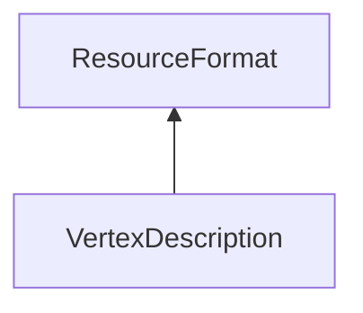

| public |
{:.api_label}

#### Inheritance Graph

## Description

 [VertexDescription](classRendering_1_1VertexDescription) 

## Public Functions

|
| ------: | ----------------- |
|  | |
| const [VertexAttribute](namespaceRendering#namespaceRendering_1a5e16ec4d55d5b46f34a1a05bdb96384a) & | **[appendFloatAttribute](#classRendering_1_1VertexDescription_1a815feecc17ff4cc3433cc5e4a68179be)**(const [Util::StringIdentifier](classUtil_1_1StringIdentifier) & nameId, uint8_t numValues)   Add an attribute with the given name and the given number of float values. |
|  | |
| const [VertexAttribute](namespaceRendering#namespaceRendering_1a5e16ec4d55d5b46f34a1a05bdb96384a) & | **[appendUnsignedIntAttribute](#classRendering_1_1VertexDescription_1a1c71dea67408030860e6d92f5f1bbf86)**(const [Util::StringIdentifier](classUtil_1_1StringIdentifier) & nameId, uint8_t numValues, bool convertToFloat)   Add an attribute with the given name and the given number of unsigned int values. |
|  | |
| const [VertexAttribute](namespaceRendering#namespaceRendering_1a5e16ec4d55d5b46f34a1a05bdb96384a) & | **[appendColorRGBAByte](#classRendering_1_1VertexDescription_1aa78ac4d97a936d8cececeacdeffbc8cd)**()   Add an RGBA color attribute. It is stored as four unsigned byte values. |
|  | |
| const [VertexAttribute](namespaceRendering#namespaceRendering_1a5e16ec4d55d5b46f34a1a05bdb96384a) & | **[appendColorRGBFloat](#classRendering_1_1VertexDescription_1a13faf70f60726a4984b6f3245df05abd)**()   Add an RGB color attribute. It is stored as three float values. |
|  | |
| const [VertexAttribute](namespaceRendering#namespaceRendering_1a5e16ec4d55d5b46f34a1a05bdb96384a) & | **[appendColorRGBAFloat](#classRendering_1_1VertexDescription_1a8b7f7ca9bb0d4012ce943d33a5043ea0)**()   Add an RGBA color attribute. It is stored as four float values. |
|  | |
| const [VertexAttribute](namespaceRendering#namespaceRendering_1a5e16ec4d55d5b46f34a1a05bdb96384a) & | **[appendNormalByte](#classRendering_1_1VertexDescription_1a5db419ee16f5861e35daeb35608e05b8)**()   Add a three-dimensional normal attribute. It is stored as four byte values. |
|  | |
| const [VertexAttribute](namespaceRendering#namespaceRendering_1a5e16ec4d55d5b46f34a1a05bdb96384a) & | **[appendNormalFloat](#classRendering_1_1VertexDescription_1a48ab40631b421120e86c0f3b5e13071a)**()   Add a three-dimensional normal attribute. It is stored as three float values. |
|  | |
| const [VertexAttribute](namespaceRendering#namespaceRendering_1a5e16ec4d55d5b46f34a1a05bdb96384a) & | **[appendPosition2D](#classRendering_1_1VertexDescription_1aa0ccbef636f49fd4925d45d24490a36a)**()   Add a two-dimensional position attribute. It is stored as two float values. |
|  | |
| const [VertexAttribute](namespaceRendering#namespaceRendering_1a5e16ec4d55d5b46f34a1a05bdb96384a) & | **[appendPosition3D](#classRendering_1_1VertexDescription_1a4ad8a757ea2b391d5798263bd94f4540)**()   Add a three-dimensional position attribute. It is stored as three float values. |
|  | |
| const [VertexAttribute](namespaceRendering#namespaceRendering_1a5e16ec4d55d5b46f34a1a05bdb96384a) & | **[appendPosition4D](#classRendering_1_1VertexDescription_1a443e8790c98515af74528a57abcd8b19)**()   Add a three-dimensional position attribute. It is stored as four float values. |
|  | |
| const [VertexAttribute](namespaceRendering#namespaceRendering_1a5e16ec4d55d5b46f34a1a05bdb96384a) & | **[appendPosition4DHalf](#classRendering_1_1VertexDescription_1a071ec8ce1d2bb9db0fa00e99af9a62d7)**()   Add a three-dimensional position attribute. It is stored as four half float values. |
|  | |
| const [VertexAttribute](namespaceRendering#namespaceRendering_1a5e16ec4d55d5b46f34a1a05bdb96384a) & | **[appendTexCoord](#classRendering_1_1VertexDescription_1a8a13a4e844cd6baea513d550339d295c)**(uint_fast8_t textureUnit)   Add a texture coordinate attribute. It is stored as two float values. |
|  | |
| size_t | **[getVertexSize](#classRendering_1_1VertexDescription_1a51da17571ce4cc8852ed3a28e3771ca5)**() const |
{: .nohead .nowrap1 .api_section }

-------------------------------------------------------------------

## Documentation

### <small>function</small>  Rendering::VertexDescription::appendFloatAttribute {#classRendering_1_1VertexDescription_1a815feecc17ff4cc3433cc5e4a68179be}

| public | inline |
{:.api_label}

|
| ------: | ----------------- |
|  |
| const [VertexAttribute](namespaceRendering#namespaceRendering_1a5e16ec4d55d5b46f34a1a05bdb96384a) & **[appendFloatAttribute](#classRendering_1_1VertexDescription_1a815feecc17ff4cc3433cc5e4a68179be)**( | const [Util::StringIdentifier](classUtil_1_1StringIdentifier) & | **nameId**, |
| | uint8_t | **numValues** |
|   ) |
{: .nohead .nowrap1 .api_doc }

Add an attribute with the given name and the given number of float values.

Defined in `Rendering/Mesh/VertexDescription.h:39`{:style="float: right"}

-------------------------------------------------------------------

### <small>function</small>  Rendering::VertexDescription::appendUnsignedIntAttribute {#classRendering_1_1VertexDescription_1a1c71dea67408030860e6d92f5f1bbf86}

| public | inline |
{:.api_label}

|
| ------: | ----------------- |
|  |
| const [VertexAttribute](namespaceRendering#namespaceRendering_1a5e16ec4d55d5b46f34a1a05bdb96384a) & **[appendUnsignedIntAttribute](#classRendering_1_1VertexDescription_1a1c71dea67408030860e6d92f5f1bbf86)**( | const [Util::StringIdentifier](classUtil_1_1StringIdentifier) & | **nameId**, |
| | uint8_t | **numValues**, |
| | bool | **convertToFloat** |
|   ) |
{: .nohead .nowrap1 .api_doc }

Add an attribute with the given name and the given number of unsigned int values.

Defined in `Rendering/Mesh/VertexDescription.h:44`{:style="float: right"}

-------------------------------------------------------------------

### <small>function</small>  Rendering::VertexDescription::appendColorRGBAByte {#classRendering_1_1VertexDescription_1aa78ac4d97a936d8cececeacdeffbc8cd}

| public | inline |
{:.api_label}

|
| ------: | ----------------- |
|  |
| const [VertexAttribute](namespaceRendering#namespaceRendering_1a5e16ec4d55d5b46f34a1a05bdb96384a) & **[appendColorRGBAByte](#classRendering_1_1VertexDescription_1aa78ac4d97a936d8cececeacdeffbc8cd)**( |  ) |
{: .nohead .nowrap1 .api_doc }

Add an RGBA color attribute. It is stored as four unsigned byte values.

Defined in `Rendering/Mesh/VertexDescription.h:49`{:style="float: right"}

-------------------------------------------------------------------

### <small>function</small>  Rendering::VertexDescription::appendColorRGBFloat {#classRendering_1_1VertexDescription_1a13faf70f60726a4984b6f3245df05abd}

| public | inline |
{:.api_label}

|
| ------: | ----------------- |
|  |
| const [VertexAttribute](namespaceRendering#namespaceRendering_1a5e16ec4d55d5b46f34a1a05bdb96384a) & **[appendColorRGBFloat](#classRendering_1_1VertexDescription_1a13faf70f60726a4984b6f3245df05abd)**( |  ) |
{: .nohead .nowrap1 .api_doc }

Add an RGB color attribute. It is stored as three float values.

Defined in `Rendering/Mesh/VertexDescription.h:54`{:style="float: right"}

-------------------------------------------------------------------

### <small>function</small>  Rendering::VertexDescription::appendColorRGBAFloat {#classRendering_1_1VertexDescription_1a8b7f7ca9bb0d4012ce943d33a5043ea0}

| public | inline |
{:.api_label}

|
| ------: | ----------------- |
|  |
| const [VertexAttribute](namespaceRendering#namespaceRendering_1a5e16ec4d55d5b46f34a1a05bdb96384a) & **[appendColorRGBAFloat](#classRendering_1_1VertexDescription_1a8b7f7ca9bb0d4012ce943d33a5043ea0)**( |  ) |
{: .nohead .nowrap1 .api_doc }

Add an RGBA color attribute. It is stored as four float values.

Defined in `Rendering/Mesh/VertexDescription.h:59`{:style="float: right"}

-------------------------------------------------------------------

### <small>function</small>  Rendering::VertexDescription::appendNormalByte {#classRendering_1_1VertexDescription_1a5db419ee16f5861e35daeb35608e05b8}

| public | inline |
{:.api_label}

|
| ------: | ----------------- |
|  |
| const [VertexAttribute](namespaceRendering#namespaceRendering_1a5e16ec4d55d5b46f34a1a05bdb96384a) & **[appendNormalByte](#classRendering_1_1VertexDescription_1a5db419ee16f5861e35daeb35608e05b8)**( |  ) |
{: .nohead .nowrap1 .api_doc }

Add a three-dimensional normal attribute. It is stored as four byte values.

Defined in `Rendering/Mesh/VertexDescription.h:64`{:style="float: right"}

-------------------------------------------------------------------

### <small>function</small>  Rendering::VertexDescription::appendNormalFloat {#classRendering_1_1VertexDescription_1a48ab40631b421120e86c0f3b5e13071a}

| public | inline |
{:.api_label}

|
| ------: | ----------------- |
|  |
| const [VertexAttribute](namespaceRendering#namespaceRendering_1a5e16ec4d55d5b46f34a1a05bdb96384a) & **[appendNormalFloat](#classRendering_1_1VertexDescription_1a48ab40631b421120e86c0f3b5e13071a)**( |  ) |
{: .nohead .nowrap1 .api_doc }

Add a three-dimensional normal attribute. It is stored as three float values.

Defined in `Rendering/Mesh/VertexDescription.h:69`{:style="float: right"}

-------------------------------------------------------------------

### <small>function</small>  Rendering::VertexDescription::appendPosition2D {#classRendering_1_1VertexDescription_1aa0ccbef636f49fd4925d45d24490a36a}

| public | inline |
{:.api_label}

|
| ------: | ----------------- |
|  |
| const [VertexAttribute](namespaceRendering#namespaceRendering_1a5e16ec4d55d5b46f34a1a05bdb96384a) & **[appendPosition2D](#classRendering_1_1VertexDescription_1aa0ccbef636f49fd4925d45d24490a36a)**( |  ) |
{: .nohead .nowrap1 .api_doc }

Add a two-dimensional position attribute. It is stored as two float values.

Defined in `Rendering/Mesh/VertexDescription.h:74`{:style="float: right"}

-------------------------------------------------------------------

### <small>function</small>  Rendering::VertexDescription::appendPosition3D {#classRendering_1_1VertexDescription_1a4ad8a757ea2b391d5798263bd94f4540}

| public | inline |
{:.api_label}

|
| ------: | ----------------- |
|  |
| const [VertexAttribute](namespaceRendering#namespaceRendering_1a5e16ec4d55d5b46f34a1a05bdb96384a) & **[appendPosition3D](#classRendering_1_1VertexDescription_1a4ad8a757ea2b391d5798263bd94f4540)**( |  ) |
{: .nohead .nowrap1 .api_doc }

Add a three-dimensional position attribute. It is stored as three float values.

Defined in `Rendering/Mesh/VertexDescription.h:79`{:style="float: right"}

-------------------------------------------------------------------

### <small>function</small>  Rendering::VertexDescription::appendPosition4D {#classRendering_1_1VertexDescription_1a443e8790c98515af74528a57abcd8b19}

| public | inline |
{:.api_label}

|
| ------: | ----------------- |
|  |
| const [VertexAttribute](namespaceRendering#namespaceRendering_1a5e16ec4d55d5b46f34a1a05bdb96384a) & **[appendPosition4D](#classRendering_1_1VertexDescription_1a443e8790c98515af74528a57abcd8b19)**( |  ) |
{: .nohead .nowrap1 .api_doc }

Add a three-dimensional position attribute. It is stored as four float values.

Defined in `Rendering/Mesh/VertexDescription.h:84`{:style="float: right"}

-------------------------------------------------------------------

### <small>function</small>  Rendering::VertexDescription::appendPosition4DHalf {#classRendering_1_1VertexDescription_1a071ec8ce1d2bb9db0fa00e99af9a62d7}

| public | inline |
{:.api_label}

|
| ------: | ----------------- |
|  |
| const [VertexAttribute](namespaceRendering#namespaceRendering_1a5e16ec4d55d5b46f34a1a05bdb96384a) & **[appendPosition4DHalf](#classRendering_1_1VertexDescription_1a071ec8ce1d2bb9db0fa00e99af9a62d7)**( |  ) |
{: .nohead .nowrap1 .api_doc }

Add a three-dimensional position attribute. It is stored as four half float values.

Defined in `Rendering/Mesh/VertexDescription.h:89`{:style="float: right"}

-------------------------------------------------------------------

### <small>function</small>  Rendering::VertexDescription::appendTexCoord {#classRendering_1_1VertexDescription_1a8a13a4e844cd6baea513d550339d295c}

| public | inline |
{:.api_label}

|
| ------: | ----------------- |
|  |
| const [VertexAttribute](namespaceRendering#namespaceRendering_1a5e16ec4d55d5b46f34a1a05bdb96384a) & **[appendTexCoord](#classRendering_1_1VertexDescription_1a8a13a4e844cd6baea513d550339d295c)**( | uint_fast8_t | **textureUnit** ) |
{: .nohead .nowrap1 .api_doc }

Add a texture coordinate attribute. It is stored as two float values.

Defined in `Rendering/Mesh/VertexDescription.h:94`{:style="float: right"}

-------------------------------------------------------------------

### <small>function</small>  Rendering::VertexDescription::getVertexSize {#classRendering_1_1VertexDescription_1a51da17571ce4cc8852ed3a28e3771ca5}

| public | const | inline |
{:.api_label}

|
| ------: | ----------------- |
|  |
| size_t **[getVertexSize](#classRendering_1_1VertexDescription_1a51da17571ce4cc8852ed3a28e3771ca5)**( |  ) const |
{: .nohead .nowrap1 .api_doc }

Defined in `Rendering/Mesh/VertexDescription.h:98`{:style="float: right"}

-------------------------------------------------------------------

