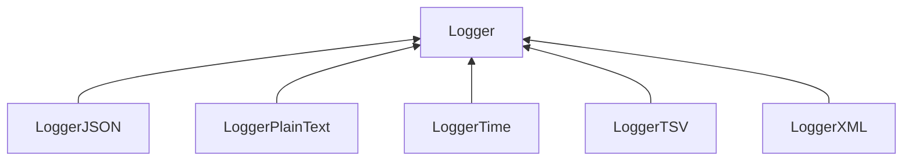

| public | abstract |
{:.api_label}

#### Inheritance Graph

## Description

Base class for logging actions. The format of the output that is written to the associated stream is determined by selecting an appropriate subclass.

## Protected Attributes

|
| ------: | ----------------- |
|  | |
| std::ostream & | **[output](#classUtil_1_1Profiling_1_1Logger_1a9f153acc723b69d86db5c783dd920208)**  |
{: .nohead .nowrap1 .api_section }

## Public Functions

|
| ------: | ----------------- |
|  | |
|  | **[Logger](#classUtil_1_1Profiling_1_1Logger_1a81458f91f7aa0119c907e6cf740fd521)**(std::ostream & outputStream) |
|  | |
|  | **[~Logger](#classUtil_1_1Profiling_1_1Logger_1a8314a309e39becbc161e5d901c03bdb6)**() |
|  | |
| void | **[log](#classUtil_1_1Profiling_1_1Logger_1a5718fc2873cbf29065d219536cd6b6b8)**(const [Action](namespaceUtil_1_1Profiling#namespaceUtil_1_1Profiling_1a2752208fc58834edce6af19c8b9c7710) & action)   Create formatted output for the given action. |
{: .nohead .nowrap1 .api_section }

-------------------------------------------------------------------

## Documentation

### <small>variable</small>  Util::Profiling::Logger::output {#classUtil_1_1Profiling_1_1Logger_1a9f153acc723b69d86db5c783dd920208}

| protected |
{:.api_label}

|
| ------: | ----------------- |
|  |
| std::ostream & **[output](#classUtil_1_1Profiling_1_1Logger_1a9f153acc723b69d86db5c783dd920208)**  |
{: .nohead .nowrap1 .api_doc }

Defined in `Util/Profiling/Logger.h:27`{:style="float: right"}

-------------------------------------------------------------------

### <small>function</small>  Util::Profiling::Logger::Logger {#classUtil_1_1Profiling_1_1Logger_1a81458f91f7aa0119c907e6cf740fd521}

| public |
{:.api_label}

|
| ------: | ----------------- |
|  |
|  **[Logger](#classUtil_1_1Profiling_1_1Logger_1a81458f91f7aa0119c907e6cf740fd521)**( | std::ostream & | **outputStream** ) |
{: .nohead .nowrap1 .api_doc }

Defined in `Util/Profiling/Logger.h:29`{:style="float: right"}

-------------------------------------------------------------------

### <small>function</small>  Util::Profiling::Logger::~Logger {#classUtil_1_1Profiling_1_1Logger_1a8314a309e39becbc161e5d901c03bdb6}

| public | virtual |
{:.api_label}

|
| ------: | ----------------- |
|  |
|  **[~Logger](#classUtil_1_1Profiling_1_1Logger_1a8314a309e39becbc161e5d901c03bdb6)**( |  ) |
{: .nohead .nowrap1 .api_doc }

Defined in `Util/Profiling/Logger.h:30`{:style="float: right"}

-------------------------------------------------------------------

### <small>function</small>  Util::Profiling::Logger::log {#classUtil_1_1Profiling_1_1Logger_1a5718fc2873cbf29065d219536cd6b6b8}

| public | virtual |
{:.api_label}

|
| ------: | ----------------- |
|  |
| void **[log](#classUtil_1_1Profiling_1_1Logger_1a5718fc2873cbf29065d219536cd6b6b8)**( | const [Action](namespaceUtil_1_1Profiling#namespaceUtil_1_1Profiling_1a2752208fc58834edce6af19c8b9c7710) & | **action** ) |
{: .nohead .nowrap1 .api_doc }

Create formatted output for the given action.

Defined in `Util/Profiling/Logger.h:33`{:style="float: right"}

-------------------------------------------------------------------

