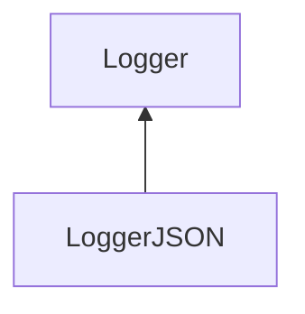

| public |
{:.api_label}

#### Inheritance Graph

## Description

[Logger](classUtil_1_1Profiling_1_1Logger) for JSON formatted data.

## Public Functions

|
| ------: | ----------------- |
|  | |
|  | **[LoggerJSON](#classUtil_1_1Profiling_1_1LoggerJSON_1aa9fcf5d215e2cc93e91b07957e269598)**(std::ostream & outputStream) |
|  | |
|  | **[~LoggerJSON](#classUtil_1_1Profiling_1_1LoggerJSON_1a919b4f69431bfa33cc8e298c54a927f9)**() |
|  | |
| void | **[log](#classUtil_1_1Profiling_1_1LoggerJSON_1a5b6c25a79ee3a0a8483f85ae3ddf7487)**(const [Action](namespaceUtil_1_1Profiling#namespaceUtil_1_1Profiling_1a2752208fc58834edce6af19c8b9c7710) & action)   Create formatted output for the given action. |
{: .nohead .nowrap1 .api_section }

-------------------------------------------------------------------

## Documentation

### <small>function</small>  Util::Profiling::LoggerJSON::LoggerJSON {#classUtil_1_1Profiling_1_1LoggerJSON_1aa9fcf5d215e2cc93e91b07957e269598}

| public |
{:.api_label}

|
| ------: | ----------------- |
|  |
|  **[LoggerJSON](#classUtil_1_1Profiling_1_1LoggerJSON_1aa9fcf5d215e2cc93e91b07957e269598)**( | std::ostream & | **outputStream** ) |
{: .nohead .nowrap1 .api_doc }

Defined in `Util/Profiling/Logger.h:39`{:style="float: right"}

-------------------------------------------------------------------

### <small>function</small>  Util::Profiling::LoggerJSON::~LoggerJSON {#classUtil_1_1Profiling_1_1LoggerJSON_1a919b4f69431bfa33cc8e298c54a927f9}

| public | virtual |
{:.api_label}

|
| ------: | ----------------- |
|  |
|  **[~LoggerJSON](#classUtil_1_1Profiling_1_1LoggerJSON_1a919b4f69431bfa33cc8e298c54a927f9)**( |  ) |
{: .nohead .nowrap1 .api_doc }

Defined in `Util/Profiling/Logger.h:40`{:style="float: right"}

-------------------------------------------------------------------

### <small>function</small>  Util::Profiling::LoggerJSON::log {#classUtil_1_1Profiling_1_1LoggerJSON_1a5b6c25a79ee3a0a8483f85ae3ddf7487}

| public | virtual |
{:.api_label}

|
| ------: | ----------------- |
|  |
| void **[log](#classUtil_1_1Profiling_1_1LoggerJSON_1a5b6c25a79ee3a0a8483f85ae3ddf7487)**( | const [Action](namespaceUtil_1_1Profiling#namespaceUtil_1_1Profiling_1a2752208fc58834edce6af19c8b9c7710) & | **action** ) |
{: .nohead .nowrap1 .api_doc }

Create formatted output for the given action.

Defined in `Util/Profiling/Logger.h:42`{:style="float: right"}

-------------------------------------------------------------------

