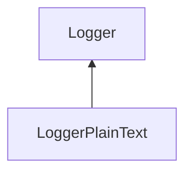

| public |
{:.api_label}

#### Inheritance Graph

## Description

[Logger](classUtil_1_1Profiling_1_1Logger) for human-readable plain text data.

## Public Functions

|
| ------: | ----------------- |
|  | |
|  | **[LoggerPlainText](#classUtil_1_1Profiling_1_1LoggerPlainText_1a4a86ede68705244536689c6fc790017f)**(std::ostream & outputStream) |
|  | |
|  | **[~LoggerPlainText](#classUtil_1_1Profiling_1_1LoggerPlainText_1ac7b34aa7440d942560bda0a881287f61)**() |
|  | |
| void | **[log](#classUtil_1_1Profiling_1_1LoggerPlainText_1a4d016b932e7d6acb23ec01b0554aa031)**(const [Action](namespaceUtil_1_1Profiling#namespaceUtil_1_1Profiling_1a2752208fc58834edce6af19c8b9c7710) & action)   Create formatted output for the given action. |
{: .nohead .nowrap1 .api_section }

-------------------------------------------------------------------

## Documentation

### <small>function</small>  Util::Profiling::LoggerPlainText::LoggerPlainText {#classUtil_1_1Profiling_1_1LoggerPlainText_1a4a86ede68705244536689c6fc790017f}

| public |
{:.api_label}

|
| ------: | ----------------- |
|  |
|  **[LoggerPlainText](#classUtil_1_1Profiling_1_1LoggerPlainText_1a4a86ede68705244536689c6fc790017f)**( | std::ostream & | **outputStream** ) |
{: .nohead .nowrap1 .api_doc }

Defined in `Util/Profiling/Logger.h:48`{:style="float: right"}

-------------------------------------------------------------------

### <small>function</small>  Util::Profiling::LoggerPlainText::~LoggerPlainText {#classUtil_1_1Profiling_1_1LoggerPlainText_1ac7b34aa7440d942560bda0a881287f61}

| public | virtual |
{:.api_label}

|
| ------: | ----------------- |
|  |
|  **[~LoggerPlainText](#classUtil_1_1Profiling_1_1LoggerPlainText_1ac7b34aa7440d942560bda0a881287f61)**( |  ) |
{: .nohead .nowrap1 .api_doc }

Defined in `Util/Profiling/Logger.h:49`{:style="float: right"}

-------------------------------------------------------------------

### <small>function</small>  Util::Profiling::LoggerPlainText::log {#classUtil_1_1Profiling_1_1LoggerPlainText_1a4d016b932e7d6acb23ec01b0554aa031}

| public | virtual |
{:.api_label}

|
| ------: | ----------------- |
|  |
| void **[log](#classUtil_1_1Profiling_1_1LoggerPlainText_1a4d016b932e7d6acb23ec01b0554aa031)**( | const [Action](namespaceUtil_1_1Profiling#namespaceUtil_1_1Profiling_1a2752208fc58834edce6af19c8b9c7710) & | **action** ) |
{: .nohead .nowrap1 .api_doc }

Create formatted output for the given action.

Defined in `Util/Profiling/Logger.h:51`{:style="float: right"}

-------------------------------------------------------------------

