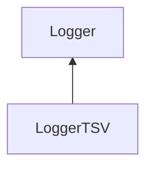

| public |
{:.api_label}

#### Inheritance Graph

## Description

[Logger](classUtil_1_1Profiling_1_1Logger) for tab-separated values.

## Public Functions

|
| ------: | ----------------- |
|  | |
|  | **[LoggerTSV](#classUtil_1_1Profiling_1_1LoggerTSV_1a1fc3b21301a58eed613368f2f724b535)**(std::ostream & outputStream) |
|  | |
|  | **[~LoggerTSV](#classUtil_1_1Profiling_1_1LoggerTSV_1aab8504132e6a68e85c841a073e139614)**() |
|  | |
| void | **[addColumn](#classUtil_1_1Profiling_1_1LoggerTSV_1ad44ca3e9d25afda98e4541dc590899db)**(const [Util::StringIdentifier](classUtil_1_1StringIdentifier) & columnName) |
|  | |
| void | **[log](#classUtil_1_1Profiling_1_1LoggerTSV_1aaf5ebdf9922e93bd32e0a382075a03a2)**(const [Action](namespaceUtil_1_1Profiling#namespaceUtil_1_1Profiling_1a2752208fc58834edce6af19c8b9c7710) & action)   Create formatted output for the given action. |
{: .nohead .nowrap1 .api_section }

-------------------------------------------------------------------

## Documentation

### <small>function</small>  Util::Profiling::LoggerTSV::LoggerTSV {#classUtil_1_1Profiling_1_1LoggerTSV_1a1fc3b21301a58eed613368f2f724b535}

| public |
{:.api_label}

|
| ------: | ----------------- |
|  |
|  **[LoggerTSV](#classUtil_1_1Profiling_1_1LoggerTSV_1a1fc3b21301a58eed613368f2f724b535)**( | std::ostream & | **outputStream** ) |
{: .nohead .nowrap1 .api_doc }

Create a new logger for tab-separated values. All entries in the output file will be formatted by means of a predefined set of columns. Before logging any actions, the default set can be extended (see [addColumn()](classUtil_1_1Profiling_1_1LoggerTSV#classUtil_1_1Profiling_1_1LoggerTSV_1ad44ca3e9d25afda98e4541dc590899db) ). At the beginning, the default columns are ATTR_description, ATTR_memoryBegin ATTR_memoryEnd, ATTR_timeBegin, and ATTR_timeEnd.

Defined in `Util/Profiling/Logger.h:70`{:style="float: right"}

-------------------------------------------------------------------

### <small>function</small>  Util::Profiling::LoggerTSV::~LoggerTSV {#classUtil_1_1Profiling_1_1LoggerTSV_1aab8504132e6a68e85c841a073e139614}

| public | virtual |
{:.api_label}

|
| ------: | ----------------- |
|  |
|  **[~LoggerTSV](#classUtil_1_1Profiling_1_1LoggerTSV_1aab8504132e6a68e85c841a073e139614)**( |  ) |
{: .nohead .nowrap1 .api_doc }

Defined in `Util/Profiling/Logger.h:71`{:style="float: right"}

-------------------------------------------------------------------

### <small>function</small>  Util::Profiling::LoggerTSV::addColumn {#classUtil_1_1Profiling_1_1LoggerTSV_1ad44ca3e9d25afda98e4541dc590899db}

| public |
{:.api_label}

|
| ------: | ----------------- |
|  |
| void **[addColumn](#classUtil_1_1Profiling_1_1LoggerTSV_1ad44ca3e9d25afda98e4541dc590899db)**( | const [Util::StringIdentifier](classUtil_1_1StringIdentifier) & | **columnName** ) |
{: .nohead .nowrap1 .api_doc }

Add a column to the set of columns used for formatting the actions that are logged.

#### Parameters
**columnName**
:  String identifier that is used in actions later on

Defined in `Util/Profiling/Logger.h:79`{:style="float: right"}

-------------------------------------------------------------------

### <small>function</small>  Util::Profiling::LoggerTSV::log {#classUtil_1_1Profiling_1_1LoggerTSV_1aaf5ebdf9922e93bd32e0a382075a03a2}

| public | virtual |
{:.api_label}

|
| ------: | ----------------- |
|  |
| void **[log](#classUtil_1_1Profiling_1_1LoggerTSV_1aaf5ebdf9922e93bd32e0a382075a03a2)**( | const [Action](namespaceUtil_1_1Profiling#namespaceUtil_1_1Profiling_1a2752208fc58834edce6af19c8b9c7710) & | **action** ) |
{: .nohead .nowrap1 .api_doc }

Create formatted output for the given action.

Defined in `Util/Profiling/Logger.h:81`{:style="float: right"}

-------------------------------------------------------------------

