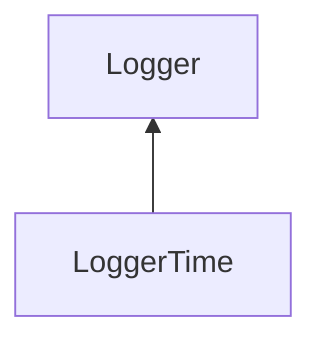

| public |
{:.api_label}

#### Inheritance Graph

## Description

[Logger](classUtil_1_1Profiling_1_1Logger) for human-readable timings.

## Public Functions

|
| ------: | ----------------- |
|  | |
|  | **[LoggerTime](#classUtil_1_1Profiling_1_1LoggerTime_1af2da21194396a39c595f4415b0d0ab4e)**(std::ostream & outputStream) |
|  | |
|  | **[~LoggerTime](#classUtil_1_1Profiling_1_1LoggerTime_1ab4d86bdc933c2d5ee7271fa6c28256ff)**() |
|  | |
| void | **[log](#classUtil_1_1Profiling_1_1LoggerTime_1a263e58ce15c32df1a0fcb3191f400317)**(const [Action](namespaceUtil_1_1Profiling#namespaceUtil_1_1Profiling_1a2752208fc58834edce6af19c8b9c7710) & action)   Create formatted output for the given action. |
{: .nohead .nowrap1 .api_section }

-------------------------------------------------------------------

## Documentation

### <small>function</small>  Util::Profiling::LoggerTime::LoggerTime {#classUtil_1_1Profiling_1_1LoggerTime_1af2da21194396a39c595f4415b0d0ab4e}

| public |
{:.api_label}

|
| ------: | ----------------- |
|  |
|  **[LoggerTime](#classUtil_1_1Profiling_1_1LoggerTime_1af2da21194396a39c595f4415b0d0ab4e)**( | std::ostream & | **outputStream** ) |
{: .nohead .nowrap1 .api_doc }

Defined in `Util/Profiling/Logger.h:97`{:style="float: right"}

-------------------------------------------------------------------

### <small>function</small>  Util::Profiling::LoggerTime::~LoggerTime {#classUtil_1_1Profiling_1_1LoggerTime_1ab4d86bdc933c2d5ee7271fa6c28256ff}

| public | virtual |
{:.api_label}

|
| ------: | ----------------- |
|  |
|  **[~LoggerTime](#classUtil_1_1Profiling_1_1LoggerTime_1ab4d86bdc933c2d5ee7271fa6c28256ff)**( |  ) |
{: .nohead .nowrap1 .api_doc }

Defined in `Util/Profiling/Logger.h:98`{:style="float: right"}

-------------------------------------------------------------------

### <small>function</small>  Util::Profiling::LoggerTime::log {#classUtil_1_1Profiling_1_1LoggerTime_1a263e58ce15c32df1a0fcb3191f400317}

| public | virtual |
{:.api_label}

|
| ------: | ----------------- |
|  |
| void **[log](#classUtil_1_1Profiling_1_1LoggerTime_1a263e58ce15c32df1a0fcb3191f400317)**( | const [Action](namespaceUtil_1_1Profiling#namespaceUtil_1_1Profiling_1a2752208fc58834edce6af19c8b9c7710) & | **action** ) |
{: .nohead .nowrap1 .api_doc }

Create formatted output for the given action.

Defined in `Util/Profiling/Logger.h:100`{:style="float: right"}

-------------------------------------------------------------------

