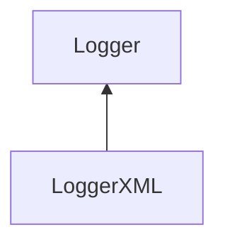

| public |
{:.api_label}

#### Inheritance Graph

## Description

[Logger](classUtil_1_1Profiling_1_1Logger) for XML formatted data.

## Public Functions

|
| ------: | ----------------- |
|  | |
|  | **[LoggerXML](#classUtil_1_1Profiling_1_1LoggerXML_1ab37b25eb0afa6ae7c8fc6bbde558e4c1)**(std::ostream & outputStream) |
|  | |
|  | **[~LoggerXML](#classUtil_1_1Profiling_1_1LoggerXML_1af48656fd26fd5ded05e97c7c40f5da59)**() |
|  | |
| void | **[log](#classUtil_1_1Profiling_1_1LoggerXML_1a98b770617a8014cf208c7b2cbec1814a)**(const [Action](namespaceUtil_1_1Profiling#namespaceUtil_1_1Profiling_1a2752208fc58834edce6af19c8b9c7710) & action)   Create formatted output for the given action. |
{: .nohead .nowrap1 .api_section }

-------------------------------------------------------------------

## Documentation

### <small>function</small>  Util::Profiling::LoggerXML::LoggerXML {#classUtil_1_1Profiling_1_1LoggerXML_1ab37b25eb0afa6ae7c8fc6bbde558e4c1}

| public |
{:.api_label}

|
| ------: | ----------------- |
|  |
|  **[LoggerXML](#classUtil_1_1Profiling_1_1LoggerXML_1ab37b25eb0afa6ae7c8fc6bbde558e4c1)**( | std::ostream & | **outputStream** ) |
{: .nohead .nowrap1 .api_doc }

Defined in `Util/Profiling/Logger.h:87`{:style="float: right"}

-------------------------------------------------------------------

### <small>function</small>  Util::Profiling::LoggerXML::~LoggerXML {#classUtil_1_1Profiling_1_1LoggerXML_1af48656fd26fd5ded05e97c7c40f5da59}

| public | virtual |
{:.api_label}

|
| ------: | ----------------- |
|  |
|  **[~LoggerXML](#classUtil_1_1Profiling_1_1LoggerXML_1af48656fd26fd5ded05e97c7c40f5da59)**( |  ) |
{: .nohead .nowrap1 .api_doc }

Defined in `Util/Profiling/Logger.h:88`{:style="float: right"}

-------------------------------------------------------------------

### <small>function</small>  Util::Profiling::LoggerXML::log {#classUtil_1_1Profiling_1_1LoggerXML_1a98b770617a8014cf208c7b2cbec1814a}

| public | virtual |
{:.api_label}

|
| ------: | ----------------- |
|  |
| void **[log](#classUtil_1_1Profiling_1_1LoggerXML_1a98b770617a8014cf208c7b2cbec1814a)**( | const [Action](namespaceUtil_1_1Profiling#namespaceUtil_1_1Profiling_1a2752208fc58834edce6af19c8b9c7710) & | **action** ) |
{: .nohead .nowrap1 .api_doc }

Create formatted output for the given action.

Defined in `Util/Profiling/Logger.h:90`{:style="float: right"}

-------------------------------------------------------------------

