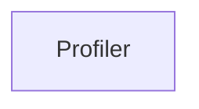

| public |
{:.api_label}

#### Inheritance Graph



## Description

[Profiling](namespaceUtil_1_1Profiling) code (measure running time, memory consumption and log it)

The profiler manages actions. An action is an extendable object that can be annotated by arbitrary attributes. The profile contains convenience functions to create actions and to annotate some standard attributes. Different loggers can be attached to the profiler that are used to write the actions to streams (e.g. a file, stdout). For example, the profiler can be used to measure the duration and memory consumption of a code section:

```cpp
Util::Profiling::Profiler profiler;
Util::Profiling::LoggerPlainText logger(std::cout);

profiler.registerLogger(&logger);

auto prepareAction = profiler.beginTimeMemoryAction("My preparation code");
...
My preparation code
...
profiler.endTimeMemoryAction(prepareAction);
auto executeAction = profiler.beginTimeMemoryAction("My execute code");
...
My execute code
...
profiler.endTimeMemoryAction(executeAction);

profiler.unregisterLogger(&logger);

```


## Public Functions

|
| ------: | ----------------- |
|  | |
|  | **[Profiler](#classUtil_1_1Profiling_1_1Profiler_1ab6552bd8d3920c86fb892982c40a4cbe)**() |
|  | |
|  | **[~Profiler](#classUtil_1_1Profiling_1_1Profiler_1a610fb397865a64ac9d65984d0efa0044)**() |
|  | |
| [Action](namespaceUtil_1_1Profiling#namespaceUtil_1_1Profiling_1a2752208fc58834edce6af19c8b9c7710) | **[createAction](#classUtil_1_1Profiling_1_1Profiler_1a979bd20ad0592469145a2af596e212f1)**(const std::string & description) const |
|  | |
| void | **[logAction](#classUtil_1_1Profiling_1_1Profiler_1adc222edaddae07727c572626c365d67b)**(const [Action](namespaceUtil_1_1Profiling#namespaceUtil_1_1Profiling_1a2752208fc58834edce6af19c8b9c7710) & action) const |
|  | |
| void | **[annotateTime](#classUtil_1_1Profiling_1_1Profiler_1a75697fabab891de22648d68bfd2bd26e)**( [Action](namespaceUtil_1_1Profiling#namespaceUtil_1_1Profiling_1a2752208fc58834edce6af19c8b9c7710) & action, const [Util::StringIdentifier](classUtil_1_1StringIdentifier) & attribute) const |
|  | |
| void | **[annotateMemory](#classUtil_1_1Profiling_1_1Profiler_1a2dfca70eb27902aaaa5fa2cd82c9b7f6)**( [Action](namespaceUtil_1_1Profiling#namespaceUtil_1_1Profiling_1a2752208fc58834edce6af19c8b9c7710) & action, const [Util::StringIdentifier](classUtil_1_1StringIdentifier) & attribute) const |
|  | |
| [Action](namespaceUtil_1_1Profiling#namespaceUtil_1_1Profiling_1a2752208fc58834edce6af19c8b9c7710) | **[beginTimeMemoryAction](#classUtil_1_1Profiling_1_1Profiler_1a41f3fd9a2e6a7e49a7d7958eac7be32b)**(const std::string & description) const |
|  | |
| void | **[endTimeMemoryAction](#classUtil_1_1Profiling_1_1Profiler_1a15195aa5e7531b1e79024cbce68da18a)**( [Action](namespaceUtil_1_1Profiling#namespaceUtil_1_1Profiling_1a2752208fc58834edce6af19c8b9c7710) & action) const |
|  | |
| void | **[registerLogger](#classUtil_1_1Profiling_1_1Profiler_1a538c581c73c83a564f332d0c78780ae8)**( [Logger](classUtil_1_1Profiling_1_1Logger) * output) |
|  | |
| void | **[unregisterLogger](#classUtil_1_1Profiling_1_1Profiler_1a47527102d5178e0b422f5bedab6d1f34)**( [Logger](classUtil_1_1Profiling_1_1Logger) * output) |
{: .nohead .nowrap1 .api_section }


-------------------------------------------------------------------

## Documentation

### <small>function</small><br/> Util::Profiling::Profiler::Profiler {#classUtil_1_1Profiling_1_1Profiler_1ab6552bd8d3920c86fb892982c40a4cbe}

| public |
{:.api_label}

|
| ------: | ----------------- |
|  |
|  **[Profiler](#classUtil_1_1Profiling_1_1Profiler_1ab6552bd8d3920c86fb892982c40a4cbe)**( |  ) |
{: .nohead .nowrap1 .api_doc }


<sub>Defined in `Util/Profiling/Profiler.h:101`</sub>{:style="float: right"}

-------------------------------------------------------------------

### <small>function</small><br/> Util::Profiling::Profiler::~Profiler {#classUtil_1_1Profiling_1_1Profiler_1a610fb397865a64ac9d65984d0efa0044}

| public |
{:.api_label}

|
| ------: | ----------------- |
|  |
|  **[~Profiler](#classUtil_1_1Profiling_1_1Profiler_1a610fb397865a64ac9d65984d0efa0044)**( |  ) |
{: .nohead .nowrap1 .api_doc }


<sub>Defined in `Util/Profiling/Profiler.h:102`</sub>{:style="float: right"}

-------------------------------------------------------------------

### <small>function</small><br/> Util::Profiling::Profiler::createAction {#classUtil_1_1Profiling_1_1Profiler_1a979bd20ad0592469145a2af596e212f1}

| public | const |
{:.api_label}

|
| ------: | ----------------- |
|  |
| [Action](namespaceUtil_1_1Profiling#namespaceUtil_1_1Profiling_1a2752208fc58834edce6af19c8b9c7710) **[createAction](#classUtil_1_1Profiling_1_1Profiler_1a979bd20ad0592469145a2af596e212f1)**( | const std::string & | **description** ) const |
{: .nohead .nowrap1 .api_doc }


Create a new action and set its description.


#### Parameters
**description**
:  Human-readable description of the action


#### Returns
The created action


<sub>Defined in `Util/Profiling/Profiler.h:110`</sub>{:style="float: right"}

-------------------------------------------------------------------

### <small>function</small><br/> Util::Profiling::Profiler::logAction {#classUtil_1_1Profiling_1_1Profiler_1adc222edaddae07727c572626c365d67b}

| public | const |
{:.api_label}

|
| ------: | ----------------- |
|  |
| void **[logAction](#classUtil_1_1Profiling_1_1Profiler_1adc222edaddae07727c572626c365d67b)**( | const [Action](namespaceUtil_1_1Profiling#namespaceUtil_1_1Profiling_1a2752208fc58834edce6af19c8b9c7710) & | **action** ) const |
{: .nohead .nowrap1 .api_doc }


Output an action to the associated loggers.


#### Parameters
**action**
:  Action that will be logged


<sub>Defined in `Util/Profiling/Profiler.h:117`</sub>{:style="float: right"}

-------------------------------------------------------------------

### <small>function</small><br/> Util::Profiling::Profiler::annotateTime {#classUtil_1_1Profiling_1_1Profiler_1a75697fabab891de22648d68bfd2bd26e}

| public | const |
{:.api_label}

|
| ------: | ----------------- |
|  |
| void **[annotateTime](#classUtil_1_1Profiling_1_1Profiler_1a75697fabab891de22648d68bfd2bd26e)**( |  [Action](namespaceUtil_1_1Profiling#namespaceUtil_1_1Profiling_1a2752208fc58834edce6af19c8b9c7710) & | **action**, |
| | const [Util::StringIdentifier](classUtil_1_1StringIdentifier) & | **attribute** |
|   ) const |
{: .nohead .nowrap1 .api_doc }


Measure the current time and store it in an attribute of an action.


#### Parameters
**action**
:  Action that will be annotated


**attribute**
:  Attribute name that will be added to the action


<sub>Defined in `Util/Profiling/Profiler.h:125`</sub>{:style="float: right"}

-------------------------------------------------------------------

### <small>function</small><br/> Util::Profiling::Profiler::annotateMemory {#classUtil_1_1Profiling_1_1Profiler_1a2dfca70eb27902aaaa5fa2cd82c9b7f6}

| public | const |
{:.api_label}

|
| ------: | ----------------- |
|  |
| void **[annotateMemory](#classUtil_1_1Profiling_1_1Profiler_1a2dfca70eb27902aaaa5fa2cd82c9b7f6)**( |  [Action](namespaceUtil_1_1Profiling#namespaceUtil_1_1Profiling_1a2752208fc58834edce6af19c8b9c7710) & | **action**, |
| | const [Util::StringIdentifier](classUtil_1_1StringIdentifier) & | **attribute** |
|   ) const |
{: .nohead .nowrap1 .api_doc }


Measure the current memory consumption and store it in an attribute of an action.


#### Parameters
**action**
:  Action that will be annotated


**attribute**
:  Attribute name that will be added to the action


<sub>Defined in `Util/Profiling/Profiler.h:135`</sub>{:style="float: right"}

-------------------------------------------------------------------

### <small>function</small><br/> Util::Profiling::Profiler::beginTimeMemoryAction {#classUtil_1_1Profiling_1_1Profiler_1a41f3fd9a2e6a7e49a7d7958eac7be32b}

| public | const |
{:.api_label}

|
| ------: | ----------------- |
|  |
| [Action](namespaceUtil_1_1Profiling#namespaceUtil_1_1Profiling_1a2752208fc58834edce6af19c8b9c7710) **[beginTimeMemoryAction](#classUtil_1_1Profiling_1_1Profiler_1a41f3fd9a2e6a7e49a7d7958eac7be32b)**( | const std::string & | **description** ) const |
{: .nohead .nowrap1 .api_doc }


Create a new action, set its description, and store current time and memory consumption of the process.


#### Parameters
**description**
:  Human-readable description of the action


#### Returns
The created action containing time and memory


<sub>Defined in `Util/Profiling/Profiler.h:145`</sub>{:style="float: right"}

-------------------------------------------------------------------

### <small>function</small><br/> Util::Profiling::Profiler::endTimeMemoryAction {#classUtil_1_1Profiling_1_1Profiler_1a15195aa5e7531b1e79024cbce68da18a}

| public | const |
{:.api_label}

|
| ------: | ----------------- |
|  |
| void **[endTimeMemoryAction](#classUtil_1_1Profiling_1_1Profiler_1a15195aa5e7531b1e79024cbce68da18a)**( |  [Action](namespaceUtil_1_1Profiling#namespaceUtil_1_1Profiling_1a2752208fc58834edce6af19c8b9c7710) & | **action** ) const |
{: .nohead .nowrap1 .api_doc }


Finish an action. The current time and memory consumption will be stored to allow comparison with the beginning of the action. The action will be logged.


#### Parameters
**action**
:  Action that will be annotated and logged


<sub>Defined in `Util/Profiling/Profiler.h:154`</sub>{:style="float: right"}

-------------------------------------------------------------------

### <small>function</small><br/> Util::Profiling::Profiler::registerLogger {#classUtil_1_1Profiling_1_1Profiler_1a538c581c73c83a564f332d0c78780ae8}

| public |
{:.api_label}

|
| ------: | ----------------- |
|  |
| void **[registerLogger](#classUtil_1_1Profiling_1_1Profiler_1a538c581c73c83a564f332d0c78780ae8)**( |  [Logger](classUtil_1_1Profiling_1_1Logger) * | **output** ) |
{: .nohead .nowrap1 .api_doc }


Register a logger that will be used to output profiling information. The information will be formatted internally by the logger.


#### Parameters
**output**
:   [Logger](classUtil_1_1Profiling_1_1Logger) that will be used to write profiling output. The given logger has to stay writeable at least until this object is destroyed or the logger is removed with* [unregisterLogger()](classUtil_1_1Profiling_1_1Profiler#classUtil_1_1Profiling_1_1Profiler_1a47527102d5178e0b422f5bedab6d1f34) *.


<sub>Defined in `Util/Profiling/Profiler.h:164`</sub>{:style="float: right"}

-------------------------------------------------------------------

### <small>function</small><br/> Util::Profiling::Profiler::unregisterLogger {#classUtil_1_1Profiling_1_1Profiler_1a47527102d5178e0b422f5bedab6d1f34}

| public |
{:.api_label}

|
| ------: | ----------------- |
|  |
| void **[unregisterLogger](#classUtil_1_1Profiling_1_1Profiler_1a47527102d5178e0b422f5bedab6d1f34)**( |  [Logger](classUtil_1_1Profiling_1_1Logger) * | **output** ) |
{: .nohead .nowrap1 .api_doc }


Remove the registered logger.


#### Parameters
**output**
:   [Logger](classUtil_1_1Profiling_1_1Logger) that will be removed


<sub>Defined in `Util/Profiling/Profiler.h:171`</sub>{:style="float: right"}

-------------------------------------------------------------------

