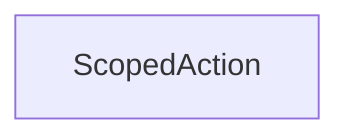

| public |
{:.api_label}

#### Inheritance Graph

## Description

## Public Functions

|
| ------: | ----------------- |
|  | |
|  | **[ScopedAction](#classUtil_1_1Profiling_1_1ScopedAction_1a2bfbd345b17d288d43e13cb7ec3cd233)**( [Profiler](classUtil_1_1Profiling_1_1Profiler) * profiler, const std::string & descr) |
|  | |
|  | **[~ScopedAction](#classUtil_1_1Profiling_1_1ScopedAction_1aeffc863bd5e6d76738001d421f450d98)**() |
{: .nohead .nowrap1 .api_section }

-------------------------------------------------------------------

## Documentation

### <small>function</small>  Util::Profiling::ScopedAction::ScopedAction {#classUtil_1_1Profiling_1_1ScopedAction_1a2bfbd345b17d288d43e13cb7ec3cd233}

| public | inline | explicit |
{:.api_label}

|
| ------: | ----------------- |
|  |
|  **[ScopedAction](#classUtil_1_1Profiling_1_1ScopedAction_1a2bfbd345b17d288d43e13cb7ec3cd233)**( |  [Profiler](classUtil_1_1Profiling_1_1Profiler) * | **profiler**, |
| | const std::string & | **descr** |
|   ) |
{: .nohead .nowrap1 .api_doc }

Defined in `Util/Profiling/Profiler.h:178`{:style="float: right"}

-------------------------------------------------------------------

### <small>function</small>  Util::Profiling::ScopedAction::~ScopedAction {#classUtil_1_1Profiling_1_1ScopedAction_1aeffc863bd5e6d76738001d421f450d98}

| public | inline |
{:.api_label}

|
| ------: | ----------------- |
|  |
|  **[~ScopedAction](#classUtil_1_1Profiling_1_1ScopedAction_1aeffc863bd5e6d76738001d421f450d98)**( |  ) |
{: .nohead .nowrap1 .api_doc }

Defined in `Util/Profiling/Profiler.h:179`{:style="float: right"}

-------------------------------------------------------------------

