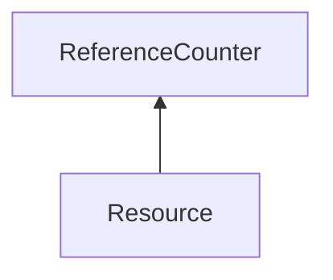

| public | abstract |
{:.api_label}

#### Inheritance Graph

## Description

## Protected Attributes

|
| ------: | ----------------- |
|  | |
| size_t | **[dataSize](#classUtil_1_1Resource_1acc2d983d3e910dddb8220a5ae0a5e13f)**  |
{: .nohead .nowrap1 .api_section }

## Public Functions

|
| ------: | ----------------- |
|  | |
|  | **[Resource](#classUtil_1_1Resource_1a7e6f330690983d73a357919e8b2be869)**(const [ResourceFormat](classUtil_1_1ResourceFormat) & format,  [ResourceAllocator](classUtil_1_1ResourceAllocator) * allocator) |
|  | |
|  | **[~Resource](#classUtil_1_1Resource_1aa3f2f0c15cbc516174c2b1d1ee91914e)**() |
|  | |
|  | **[Resource](#classUtil_1_1Resource_1a341177c7d81f55198c0b6c6e067ef1bf)**(const [Resource](classUtil_1_1Resource) & void) |
|  | |
|  | **[Resource](#classUtil_1_1Resource_1a9657e1ee72ecf8df639bb0c58720e771)**( [Resource](classUtil_1_1Resource) && void) |
|  | |
| [Resource](classUtil_1_1Resource) & | **[operator=](#classUtil_1_1Resource_1a857b384226c226d5c73ee6de7b932379)**(const [Resource](classUtil_1_1Resource) & o) |
|  | |
| [Resource](classUtil_1_1Resource) & | **[operator=](#classUtil_1_1Resource_1a35a5d077257c874c2334760e541bab30)**( [Resource](classUtil_1_1Resource) && o) |
|  | |
| void | **[upload](#classUtil_1_1Resource_1a9aec5bc83143c523d64789b99016baed)**(const uint8_t * srcData, size_t size, size_t offset) |
| template< typename T  >  | |
| void | **[upload](#classUtil_1_1Resource_1a14d79507937164a83bdf1b3f4579e68a)**(const std::vector< T > & data, size_t offset) |
|  | |
| void | **[download](#classUtil_1_1Resource_1a1ba1640853c0f1c3d91b6066bb975d42)**(uint8_t * tgtData, size_t size, size_t offset) |
| template< typename T  >  | |
| std::vector< T > | **[download](#classUtil_1_1Resource_1ae4bbde6008407b6fd08f5942ba762546)**(size_t numberOfElements, size_t offset) |
|  | |
| void | **[release](#classUtil_1_1Resource_1a8f5c239ed9b1956b8a6de968b6545448)**() |
|  | |
| void | **[flush](#classUtil_1_1Resource_1abc48f5c48eb555d781570ff84252863e)**() |
|  | |
| uint8_t * | **[map](#classUtil_1_1Resource_1a262487e5e329796e5fc5b354d4570439)**() |
|  | |
| void | **[unmap](#classUtil_1_1Resource_1aca830f0e5838c2ccbb41bd11b1dad828)**() |
|  | |
| size_t | **[getSize](#classUtil_1_1Resource_1a611782db978a2c85824d667bd9b9cc89)**() const |
|  | |
| const [ResourceFormat](classUtil_1_1ResourceFormat) & | **[getFormat](#classUtil_1_1Resource_1ac3447b72dac27b36736556027d5b1762)**() const |
{: .nohead .nowrap1 .api_section }

## Protected Functions

|
| ------: | ----------------- |
|  | |
| bool | **[checkRange](#classUtil_1_1Resource_1ac95a4ed4721e5437e6185c837509413e)**(size_t offset, size_t size) const |
{: .nohead .nowrap1 .api_section }

-------------------------------------------------------------------

## Documentation

### <small>variable</small>  Util::Resource::dataSize {#classUtil_1_1Resource_1acc2d983d3e910dddb8220a5ae0a5e13f}

| protected |
{:.api_label}

|
| ------: | ----------------- |
|  |
| size_t **[dataSize](#classUtil_1_1Resource_1acc2d983d3e910dddb8220a5ae0a5e13f)**  |
{: .nohead .nowrap1 .api_doc }

Defined in `Util/Resources/Resource.h:56`{:style="float: right"}

-------------------------------------------------------------------

### <small>function</small>  Util::Resource::Resource {#classUtil_1_1Resource_1a7e6f330690983d73a357919e8b2be869}

| public | explicit |
{:.api_label}

|
| ------: | ----------------- |
|  |
|  **[Resource](#classUtil_1_1Resource_1a7e6f330690983d73a357919e8b2be869)**( | const [ResourceFormat](classUtil_1_1ResourceFormat) & | **format**, |
| |  [ResourceAllocator](classUtil_1_1ResourceAllocator) * | **allocator** |
|   ) |
{: .nohead .nowrap1 .api_doc }

Defined in `Util/Resources/Resource.h:24`{:style="float: right"}

-------------------------------------------------------------------

### <small>function</small>  Util::Resource::~Resource {#classUtil_1_1Resource_1aa3f2f0c15cbc516174c2b1d1ee91914e}

| public | virtual |
{:.api_label}

|
| ------: | ----------------- |
|  |
|  **[~Resource](#classUtil_1_1Resource_1aa3f2f0c15cbc516174c2b1d1ee91914e)**( |  ) |
{: .nohead .nowrap1 .api_doc }

Defined in `Util/Resources/Resource.h:25`{:style="float: right"}

-------------------------------------------------------------------

### <small>function</small>  Util::Resource::Resource {#classUtil_1_1Resource_1a341177c7d81f55198c0b6c6e067ef1bf}

| public |
{:.api_label}

|
| ------: | ----------------- |
|  |
|  **[Resource](#classUtil_1_1Resource_1a341177c7d81f55198c0b6c6e067ef1bf)**( | const [Resource](classUtil_1_1Resource) & | **void** ) |
{: .nohead .nowrap1 .api_doc }

Defined in `Util/Resources/Resource.h:26`{:style="float: right"}

-------------------------------------------------------------------

### <small>function</small>  Util::Resource::Resource {#classUtil_1_1Resource_1a9657e1ee72ecf8df639bb0c58720e771}

| public |
{:.api_label}

|
| ------: | ----------------- |
|  |
|  **[Resource](#classUtil_1_1Resource_1a9657e1ee72ecf8df639bb0c58720e771)**( |  [Resource](classUtil_1_1Resource) && | **void** ) |
{: .nohead .nowrap1 .api_doc }

Defined in `Util/Resources/Resource.h:27`{:style="float: right"}

-------------------------------------------------------------------

### <small>function</small>  Util::Resource::operator= {#classUtil_1_1Resource_1a857b384226c226d5c73ee6de7b932379}

| public |
{:.api_label}

|
| ------: | ----------------- |
|  |
| [Resource](classUtil_1_1Resource) & **[operator=](#classUtil_1_1Resource_1a857b384226c226d5c73ee6de7b932379)**( | const [Resource](classUtil_1_1Resource) & | **o** ) |
{: .nohead .nowrap1 .api_doc }

Defined in `Util/Resources/Resource.h:28`{:style="float: right"}

-------------------------------------------------------------------

### <small>function</small>  Util::Resource::operator= {#classUtil_1_1Resource_1a35a5d077257c874c2334760e541bab30}

| public |
{:.api_label}

|
| ------: | ----------------- |
|  |
| [Resource](classUtil_1_1Resource) & **[operator=](#classUtil_1_1Resource_1a35a5d077257c874c2334760e541bab30)**( |  [Resource](classUtil_1_1Resource) && | **o** ) |
{: .nohead .nowrap1 .api_doc }

Defined in `Util/Resources/Resource.h:29`{:style="float: right"}

-------------------------------------------------------------------

### <small>function</small>  Util::Resource::upload {#classUtil_1_1Resource_1a9aec5bc83143c523d64789b99016baed}

| public | virtual |
{:.api_label}

|
| ------: | ----------------- |
|  |
| void **[upload](#classUtil_1_1Resource_1a9aec5bc83143c523d64789b99016baed)**( | const uint8_t * | **srcData**, |
| | size_t | **size**, |
| | size_t | **offset** |
|   ) |
{: .nohead .nowrap1 .api_doc }

Defined in `Util/Resources/Resource.h:31`{:style="float: right"}

-------------------------------------------------------------------

### <small>function</small>  Util::Resource::upload {#classUtil_1_1Resource_1a14d79507937164a83bdf1b3f4579e68a}

| public | inline |
{:.api_label}

|
| ------: | ----------------- |
| template< typename T  > |
| void **[upload](#classUtil_1_1Resource_1a14d79507937164a83bdf1b3f4579e68a)**( | const std::vector< T > & | **data**, |
| | size_t | **offset** |
|   ) |
{: .nohead .nowrap1 .api_doc }

Defined in `Util/Resources/Resource.h:34`{:style="float: right"}

-------------------------------------------------------------------

### <small>function</small>  Util::Resource::download {#classUtil_1_1Resource_1a1ba1640853c0f1c3d91b6066bb975d42}

| public | virtual |
{:.api_label}

|
| ------: | ----------------- |
|  |
| void **[download](#classUtil_1_1Resource_1a1ba1640853c0f1c3d91b6066bb975d42)**( | uint8_t * | **tgtData**, |
| | size_t | **size**, |
| | size_t | **offset** |
|   ) |
{: .nohead .nowrap1 .api_doc }

Defined in `Util/Resources/Resource.h:38`{:style="float: right"}

-------------------------------------------------------------------

### <small>function</small>  Util::Resource::download {#classUtil_1_1Resource_1ae4bbde6008407b6fd08f5942ba762546}

| public | inline |
{:.api_label}

|
| ------: | ----------------- |
| template< typename T  > |
| std::vector< T > **[download](#classUtil_1_1Resource_1ae4bbde6008407b6fd08f5942ba762546)**( | size_t | **numberOfElements**, |
| | size_t | **offset** |
|   ) |
{: .nohead .nowrap1 .api_doc }

Defined in `Util/Resources/Resource.h:41`{:style="float: right"}

-------------------------------------------------------------------

### <small>function</small>  Util::Resource::release {#classUtil_1_1Resource_1a8f5c239ed9b1956b8a6de968b6545448}

| public | inline | virtual |
{:.api_label}

|
| ------: | ----------------- |
|  |
| void **[release](#classUtil_1_1Resource_1a8f5c239ed9b1956b8a6de968b6545448)**( |  ) |
{: .nohead .nowrap1 .api_doc }

Defined in `Util/Resources/Resource.h:47`{:style="float: right"}

-------------------------------------------------------------------

### <small>function</small>  Util::Resource::flush {#classUtil_1_1Resource_1abc48f5c48eb555d781570ff84252863e}

| public | inline | virtual |
{:.api_label}

|
| ------: | ----------------- |
|  |
| void **[flush](#classUtil_1_1Resource_1abc48f5c48eb555d781570ff84252863e)**( |  ) |
{: .nohead .nowrap1 .api_doc }

Defined in `Util/Resources/Resource.h:49`{:style="float: right"}

-------------------------------------------------------------------

### <small>function</small>  Util::Resource::map {#classUtil_1_1Resource_1a262487e5e329796e5fc5b354d4570439}

| public | virtual |
{:.api_label}

|
| ------: | ----------------- |
|  |
| uint8_t * **[map](#classUtil_1_1Resource_1a262487e5e329796e5fc5b354d4570439)**( |  ) |
{: .nohead .nowrap1 .api_doc }

Defined in `Util/Resources/Resource.h:50`{:style="float: right"}

-------------------------------------------------------------------

### <small>function</small>  Util::Resource::unmap {#classUtil_1_1Resource_1aca830f0e5838c2ccbb41bd11b1dad828}

| public | inline | virtual |
{:.api_label}

|
| ------: | ----------------- |
|  |
| void **[unmap](#classUtil_1_1Resource_1aca830f0e5838c2ccbb41bd11b1dad828)**( |  ) |
{: .nohead .nowrap1 .api_doc }

Defined in `Util/Resources/Resource.h:51`{:style="float: right"}

-------------------------------------------------------------------

### <small>function</small>  Util::Resource::getSize {#classUtil_1_1Resource_1a611782db978a2c85824d667bd9b9cc89}

| public | const | inline |
{:.api_label}

|
| ------: | ----------------- |
|  |
| size_t **[getSize](#classUtil_1_1Resource_1a611782db978a2c85824d667bd9b9cc89)**( |  ) const |
{: .nohead .nowrap1 .api_doc }

Defined in `Util/Resources/Resource.h:53`{:style="float: right"}

-------------------------------------------------------------------

### <small>function</small>  Util::Resource::getFormat {#classUtil_1_1Resource_1ac3447b72dac27b36736556027d5b1762}

| public | const | inline |
{:.api_label}

|
| ------: | ----------------- |
|  |
| const [ResourceFormat](classUtil_1_1ResourceFormat) & **[getFormat](#classUtil_1_1Resource_1ac3447b72dac27b36736556027d5b1762)**( |  ) const |
{: .nohead .nowrap1 .api_doc }

Defined in `Util/Resources/Resource.h:54`{:style="float: right"}

-------------------------------------------------------------------

### <small>function</small>  Util::Resource::checkRange {#classUtil_1_1Resource_1ac95a4ed4721e5437e6185c837509413e}

| protected | const | inline |
{:.api_label}

|
| ------: | ----------------- |
|  |
| bool **[checkRange](#classUtil_1_1Resource_1ac95a4ed4721e5437e6185c837509413e)**( | size_t | **offset**, |
| | size_t | **size** |
|   ) const |
{: .nohead .nowrap1 .api_doc }

Defined in `Util/Resources/Resource.h:57`{:style="float: right"}

-------------------------------------------------------------------

