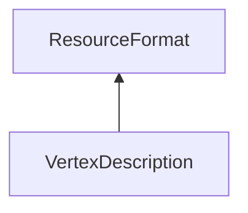

| public |
{:.api_label}

#### Inheritance Graph

## Description

 [ResourceFormat](classUtil_1_1ResourceFormat) 

## Public Types

|
| ------: | ----------------- |
|  | |
| typedef [AttributeFormat](classUtil_1_1AttributeFormat) | **[Attribute](#classUtil_1_1ResourceFormat_1a309b6b22e6cab61a9277ca9d5ca08284)**  |
|  | |
| typedef std::deque< [Attribute](classUtil_1_1ResourceFormat#classUtil_1_1ResourceFormat_1a309b6b22e6cab61a9277ca9d5ca08284) > | **[AttributeContainer_t](#classUtil_1_1ResourceFormat_1a18b0e745322fd972be045c949ba952eb)**  |
{: .nohead .nowrap1 .api_section }

## Public Functions

|
| ------: | ----------------- |
|  | |
|  | **[ResourceFormat](#classUtil_1_1ResourceFormat_1a1a96d0b123b08220cfa9c634fef5f4aa)**(size_t _attributeAlignment) |
|  | |
|  | **[~ResourceFormat](#classUtil_1_1ResourceFormat_1ad210e59369ce9c9f1903522169f1b2f2)**() |
|  | |
| const [Attribute](classUtil_1_1ResourceFormat#classUtil_1_1ResourceFormat_1a309b6b22e6cab61a9277ca9d5ca08284) & | **[appendAttribute](#classUtil_1_1ResourceFormat_1a6760644ae2b1bf8377555ae2672e7954)**(const [StringIdentifier](classUtil_1_1StringIdentifier) & nameId,  [TypeConstant](group%5F%5Futil%5F%5Fhelper#group%5F%5Futil%5F%5Fhelper_1ga1a435620d3040a5fff9aa70ec2be94a1)  type, uint32_t numValues, bool normalized, uint32_t internalType) |
|  | |
| const [Attribute](classUtil_1_1ResourceFormat#classUtil_1_1ResourceFormat_1a309b6b22e6cab61a9277ca9d5ca08284) & | **[_appendAttribute](#classUtil_1_1ResourceFormat_1a96f90fc21fee87b238bd90afabb1fc4d)**(const [StringIdentifier](classUtil_1_1StringIdentifier) & nameId,  [TypeConstant](group%5F%5Futil%5F%5Fhelper#group%5F%5Futil%5F%5Fhelper_1ga1a435620d3040a5fff9aa70ec2be94a1)  type, uint32_t numValues, bool normalized, uint32_t internalType, size_t offset)   directly appends the attribute without recalculating offsets |
|  | |
| const [Attribute](classUtil_1_1ResourceFormat#classUtil_1_1ResourceFormat_1a309b6b22e6cab61a9277ca9d5ca08284) & | **[appendFloat](#classUtil_1_1ResourceFormat_1a9943a77b5c563b56485d10a465dd9ad0)**(const [Util::StringIdentifier](classUtil_1_1StringIdentifier) & nameId, uint32_t numValues, bool normalized)   Add an attribute with the given name and the given number of float values. |
|  | |
| const [Attribute](classUtil_1_1ResourceFormat#classUtil_1_1ResourceFormat_1a309b6b22e6cab61a9277ca9d5ca08284) & | **[appendUInt](#classUtil_1_1ResourceFormat_1accf83b399b4cee2cf388bd0a6313bbbb)**(const [Util::StringIdentifier](classUtil_1_1StringIdentifier) & nameId, uint32_t numValues)   Add an attribute with the given name and the given number of unsigned int values. |
|  | |
| const [Attribute](classUtil_1_1ResourceFormat#classUtil_1_1ResourceFormat_1a309b6b22e6cab61a9277ca9d5ca08284) & | **[appendInt](#classUtil_1_1ResourceFormat_1a31d6a179a3ec45a25a4453dca4f7f775)**(const [Util::StringIdentifier](classUtil_1_1StringIdentifier) & nameId, uint32_t numValues)   Add an attribute with the given name and the given number of int values. |
|  | |
| const [Attribute](classUtil_1_1ResourceFormat#classUtil_1_1ResourceFormat_1a309b6b22e6cab61a9277ca9d5ca08284) & | **[getAttribute](#classUtil_1_1ResourceFormat_1a0c8fb406314c0f6e8c93570e6157da6e)**(const [StringIdentifier](classUtil_1_1StringIdentifier) & nameId) const |
|  | |
| const [Attribute](classUtil_1_1ResourceFormat#classUtil_1_1ResourceFormat_1a309b6b22e6cab61a9277ca9d5ca08284) & | **[getAttribute](#classUtil_1_1ResourceFormat_1a605b726096243999687e274a47609329)**(const std::string & name) const |
|  | |
| const [Attribute](classUtil_1_1ResourceFormat#classUtil_1_1ResourceFormat_1a309b6b22e6cab61a9277ca9d5ca08284) & | **[getAttribute](#classUtil_1_1ResourceFormat_1a54ccf5565834fc13c2d74ae4bec412bc)**(uint32_t location) const |
|  | |
| bool | **[hasAttribute](#classUtil_1_1ResourceFormat_1a98f47236bedc7160bf06c55fb8b3d808)**(const [StringIdentifier](classUtil_1_1StringIdentifier) & nameId) const |
|  | |
| bool | **[hasAttribute](#classUtil_1_1ResourceFormat_1a4f35f7087798a43cbc3b68619dbcb524)**(const std::string & name) const |
|  | |
| const uint32_t | **[getAttributeLocation](#classUtil_1_1ResourceFormat_1a633fc855bebea15ac152d8275cd80743)**(const [StringIdentifier](classUtil_1_1StringIdentifier) & nameId) const   Returns the location index of the attribute within the the resource format. |
|  | |
| const uint32_t | **[getAttributeLocation](#classUtil_1_1ResourceFormat_1a7a66282cff25adce9a9e31db9f869e43)**(const std::string & name) const |
|  | |
| void | **[updateAttribute](#classUtil_1_1ResourceFormat_1a3095b190bb8fc8de0b52f7ddb8b7d61b)**(const [Attribute](classUtil_1_1ResourceFormat#classUtil_1_1ResourceFormat_1a309b6b22e6cab61a9277ca9d5ca08284) & attr) |
|  | |
| void | **[merge](#classUtil_1_1ResourceFormat_1a982f074007dcbf3eb2729e648946b445)**(const [ResourceFormat](classUtil_1_1ResourceFormat) & other)   Merges this resource format with another. |
|  | |
| uint32_t | **[getNumAttributes](#classUtil_1_1ResourceFormat_1aad8358aff8ba1beeb64fd570fd36bc7f)**() const   Returns the number of attributes. |
|  | |
| const [AttributeContainer_t](classUtil_1_1ResourceFormat#classUtil_1_1ResourceFormat_1a18b0e745322fd972be045c949ba952eb) & | **[getAttributes](#classUtil_1_1ResourceFormat_1a62b2f6e1cf8ae7bca8919e5027cfb1ad)**() const |
|  | |
| void | **[setSize](#classUtil_1_1ResourceFormat_1a7c049a13c116419831e6066d35eadb94)**(size_t value) |
|  | |
| size_t | **[getSize](#classUtil_1_1ResourceFormat_1aad98fbef6b04002337755db5a9fb362d)**() const |
|  | |
| size_t | **[getAlignment](#classUtil_1_1ResourceFormat_1af94a58b0f11ee0e03d7dcb857c6a4289)**() const |
|  | |
| std::string | **[toString](#classUtil_1_1ResourceFormat_1a82038201cf92bce2f64f1bf0e488fca4)**(bool formatted) const |
|  | |
| bool | **[operator==](#classUtil_1_1ResourceFormat_1a1a6cbd22f178c750dfc72c25145d7bc2)**(const [ResourceFormat](classUtil_1_1ResourceFormat) & other) const |
|  | |
| bool | **[operator!=](#classUtil_1_1ResourceFormat_1a0ed1f3aa82624ce95af430b359ef6f90)**(const [ResourceFormat](classUtil_1_1ResourceFormat) & other) const |
|  | |
| bool | **[operator&lt;](#classUtil_1_1ResourceFormat_1a0b0051d18e9602f5dcfb45e96e7aced1)**(const [ResourceFormat](classUtil_1_1ResourceFormat) & other) const |
{: .nohead .nowrap1 .api_section }

-------------------------------------------------------------------

## Documentation

### <small>typedef</small>  Util::ResourceFormat::Attribute {#classUtil_1_1ResourceFormat_1a309b6b22e6cab61a9277ca9d5ca08284}

| public |
{:.api_label}

|
| ------: | ----------------- |
|  |
| typedef [AttributeFormat](classUtil_1_1AttributeFormat) **[Attribute](#classUtil_1_1ResourceFormat_1a309b6b22e6cab61a9277ca9d5ca08284)**  |
{: .nohead .nowrap1 .api_doc }

Defined in `Util/Resources/ResourceFormat.h:31`{:style="float: right"}

-------------------------------------------------------------------

### <small>typedef</small>  Util::ResourceFormat::AttributeContainer_t {#classUtil_1_1ResourceFormat_1a18b0e745322fd972be045c949ba952eb}

| public |
{:.api_label}

|
| ------: | ----------------- |
|  |
| typedef std::deque< [Attribute](classUtil_1_1ResourceFormat#classUtil_1_1ResourceFormat_1a309b6b22e6cab61a9277ca9d5ca08284) > **[AttributeContainer_t](#classUtil_1_1ResourceFormat_1a18b0e745322fd972be045c949ba952eb)**  |
{: .nohead .nowrap1 .api_doc }

Defined in `Util/Resources/ResourceFormat.h:32`{:style="float: right"}

-------------------------------------------------------------------

### <small>function</small>  Util::ResourceFormat::ResourceFormat {#classUtil_1_1ResourceFormat_1a1a96d0b123b08220cfa9c634fef5f4aa}

| public | inline |
{:.api_label}

|
| ------: | ----------------- |
|  |
|  **[ResourceFormat](#classUtil_1_1ResourceFormat_1a1a96d0b123b08220cfa9c634fef5f4aa)**( | size_t | **_attributeAlignment** ) |
{: .nohead .nowrap1 .api_doc }

Defined in `Util/Resources/ResourceFormat.h:34`{:style="float: right"}

-------------------------------------------------------------------

### <small>function</small>  Util::ResourceFormat::~ResourceFormat {#classUtil_1_1ResourceFormat_1ad210e59369ce9c9f1903522169f1b2f2}

| public | virtual |
{:.api_label}

|
| ------: | ----------------- |
|  |
|  **[~ResourceFormat](#classUtil_1_1ResourceFormat_1ad210e59369ce9c9f1903522169f1b2f2)**( |  ) |
{: .nohead .nowrap1 .api_doc }

Defined in `Util/Resources/ResourceFormat.h:35`{:style="float: right"}

-------------------------------------------------------------------

### <small>function</small>  Util::ResourceFormat::appendAttribute {#classUtil_1_1ResourceFormat_1a6760644ae2b1bf8377555ae2672e7954}

| public |
{:.api_label}

|
| ------: | ----------------- |
|  |
| const [Attribute](classUtil_1_1ResourceFormat#classUtil_1_1ResourceFormat_1a309b6b22e6cab61a9277ca9d5ca08284) & **[appendAttribute](#classUtil_1_1ResourceFormat_1a6760644ae2b1bf8377555ae2672e7954)**( | const [StringIdentifier](classUtil_1_1StringIdentifier) & | **nameId**, |
| |  [TypeConstant](group%5F%5Futil%5F%5Fhelper#group%5F%5Futil%5F%5Fhelper_1ga1a435620d3040a5fff9aa70ec2be94a1)  | **type**, |
| | uint32_t | **numValues**, |
| | bool | **normalized**, |
| | uint32_t | **internalType** |
|   ) |
{: .nohead .nowrap1 .api_doc }

Create and add a new attribute to the [ResourceFormat](classUtil_1_1ResourceFormat) .
#### Parameters
**nameId**
:  The name of the attribute.

**type**
:  The base type of the attribute.

**numValue**
:  The number of channels the attribute has (e.g., 3 for RGB)

**normalized**
:  Specifies that the underlying type is automatically converted to/from float value in the range [-1.0,1.0] or [0.0,1.0]

**internalType**
:  User defined internal type id (e.g., for compressed data).

#### Returns
the new attribute

> **Note**: the owner of the attribute is the [ResourceFormat](classUtil_1_1ResourceFormat) 

> **Note**: Before using this function, check a default method can be used instead (e.g.`appendFloat`)

> **Note**: When`internalType`is set, the`type`and`numValues`are still used for size calculation, e.g., if a R10G10B10A2 attribute is packed into a single 32 bit integer, the numValues should be 1.

Defined in `Util/Resources/ResourceFormat.h:49`{:style="float: right"}

-------------------------------------------------------------------

### <small>function</small>  Util::ResourceFormat::_appendAttribute {#classUtil_1_1ResourceFormat_1a96f90fc21fee87b238bd90afabb1fc4d}

| public |
{:.api_label}

|
| ------: | ----------------- |
|  |
| const [Attribute](classUtil_1_1ResourceFormat#classUtil_1_1ResourceFormat_1a309b6b22e6cab61a9277ca9d5ca08284) & **[_appendAttribute](#classUtil_1_1ResourceFormat_1a96f90fc21fee87b238bd90afabb1fc4d)**( | const [StringIdentifier](classUtil_1_1StringIdentifier) & | **nameId**, |
| |  [TypeConstant](group%5F%5Futil%5F%5Fhelper#group%5F%5Futil%5F%5Fhelper_1ga1a435620d3040a5fff9aa70ec2be94a1)  | **type**, |
| | uint32_t | **numValues**, |
| | bool | **normalized**, |
| | uint32_t | **internalType**, |
| | size_t | **offset** |
|   ) |
{: .nohead .nowrap1 .api_doc }

directly appends the attribute without recalculating offsets

Defined in `Util/Resources/ResourceFormat.h:52`{:style="float: right"}

-------------------------------------------------------------------

### <small>function</small>  Util::ResourceFormat::appendFloat {#classUtil_1_1ResourceFormat_1a9943a77b5c563b56485d10a465dd9ad0}

| public | inline |
{:.api_label}

|
| ------: | ----------------- |
|  |
| const [Attribute](classUtil_1_1ResourceFormat#classUtil_1_1ResourceFormat_1a309b6b22e6cab61a9277ca9d5ca08284) & **[appendFloat](#classUtil_1_1ResourceFormat_1a9943a77b5c563b56485d10a465dd9ad0)**( | const [Util::StringIdentifier](classUtil_1_1StringIdentifier) & | **nameId**, |
| | uint32_t | **numValues**, |
| | bool | **normalized** |
|   ) |
{: .nohead .nowrap1 .api_doc }

Add an attribute with the given name and the given number of float values.

Defined in `Util/Resources/ResourceFormat.h:55`{:style="float: right"}

-------------------------------------------------------------------

### <small>function</small>  Util::ResourceFormat::appendUInt {#classUtil_1_1ResourceFormat_1accf83b399b4cee2cf388bd0a6313bbbb}

| public | inline |
{:.api_label}

|
| ------: | ----------------- |
|  |
| const [Attribute](classUtil_1_1ResourceFormat#classUtil_1_1ResourceFormat_1a309b6b22e6cab61a9277ca9d5ca08284) & **[appendUInt](#classUtil_1_1ResourceFormat_1accf83b399b4cee2cf388bd0a6313bbbb)**( | const [Util::StringIdentifier](classUtil_1_1StringIdentifier) & | **nameId**, |
| | uint32_t | **numValues** |
|   ) |
{: .nohead .nowrap1 .api_doc }

Add an attribute with the given name and the given number of unsigned int values.

Defined in `Util/Resources/ResourceFormat.h:60`{:style="float: right"}

-------------------------------------------------------------------

### <small>function</small>  Util::ResourceFormat::appendInt {#classUtil_1_1ResourceFormat_1a31d6a179a3ec45a25a4453dca4f7f775}

| public | inline |
{:.api_label}

|
| ------: | ----------------- |
|  |
| const [Attribute](classUtil_1_1ResourceFormat#classUtil_1_1ResourceFormat_1a309b6b22e6cab61a9277ca9d5ca08284) & **[appendInt](#classUtil_1_1ResourceFormat_1a31d6a179a3ec45a25a4453dca4f7f775)**( | const [Util::StringIdentifier](classUtil_1_1StringIdentifier) & | **nameId**, |
| | uint32_t | **numValues** |
|   ) |
{: .nohead .nowrap1 .api_doc }

Add an attribute with the given name and the given number of int values.

Defined in `Util/Resources/ResourceFormat.h:65`{:style="float: right"}

-------------------------------------------------------------------

### <small>function</small>  Util::ResourceFormat::getAttribute {#classUtil_1_1ResourceFormat_1a0c8fb406314c0f6e8c93570e6157da6e}

| public | const |
{:.api_label}

|
| ------: | ----------------- |
|  |
| const [Attribute](classUtil_1_1ResourceFormat#classUtil_1_1ResourceFormat_1a309b6b22e6cab61a9277ca9d5ca08284) & **[getAttribute](#classUtil_1_1ResourceFormat_1a0c8fb406314c0f6e8c93570e6157da6e)**( | const [StringIdentifier](classUtil_1_1StringIdentifier) & | **nameId** ) const |
{: .nohead .nowrap1 .api_doc }

Get a reference to the attribute with the corresponding name.
#### Returns
Always returns an attribute. If the attribute is not present in the vertex description, it is empty.

> **Note**: The owner of the attribute is the [ResourceFormat](classUtil_1_1ResourceFormat) , so be careful if the [ResourceFormat](classUtil_1_1ResourceFormat) is deleted or reassigned.

Defined in `Util/Resources/ResourceFormat.h:74`{:style="float: right"}

-------------------------------------------------------------------

### <small>function</small>  Util::ResourceFormat::getAttribute {#classUtil_1_1ResourceFormat_1a605b726096243999687e274a47609329}

| public | const | inline |
{:.api_label}

|
| ------: | ----------------- |
|  |
| const [Attribute](classUtil_1_1ResourceFormat#classUtil_1_1ResourceFormat_1a309b6b22e6cab61a9277ca9d5ca08284) & **[getAttribute](#classUtil_1_1ResourceFormat_1a605b726096243999687e274a47609329)**( | const std::string & | **name** ) const |
{: .nohead .nowrap1 .api_doc }

Defined in `Util/Resources/ResourceFormat.h:75`{:style="float: right"}

-------------------------------------------------------------------

### <small>function</small>  Util::ResourceFormat::getAttribute {#classUtil_1_1ResourceFormat_1a54ccf5565834fc13c2d74ae4bec412bc}

| public | const | inline |
{:.api_label}

|
| ------: | ----------------- |
|  |
| const [Attribute](classUtil_1_1ResourceFormat#classUtil_1_1ResourceFormat_1a309b6b22e6cab61a9277ca9d5ca08284) & **[getAttribute](#classUtil_1_1ResourceFormat_1a54ccf5565834fc13c2d74ae4bec412bc)**( | uint32_t | **location** ) const |
{: .nohead .nowrap1 .api_doc }

Defined in `Util/Resources/ResourceFormat.h:78`{:style="float: right"}

-------------------------------------------------------------------

### <small>function</small>  Util::ResourceFormat::hasAttribute {#classUtil_1_1ResourceFormat_1a98f47236bedc7160bf06c55fb8b3d808}

| public | const |
{:.api_label}

|
| ------: | ----------------- |
|  |
| bool **[hasAttribute](#classUtil_1_1ResourceFormat_1a98f47236bedc7160bf06c55fb8b3d808)**( | const [StringIdentifier](classUtil_1_1StringIdentifier) & | **nameId** ) const |
{: .nohead .nowrap1 .api_doc }

Defined in `Util/Resources/ResourceFormat.h:82`{:style="float: right"}

-------------------------------------------------------------------

### <small>function</small>  Util::ResourceFormat::hasAttribute {#classUtil_1_1ResourceFormat_1a4f35f7087798a43cbc3b68619dbcb524}

| public | const | inline |
{:.api_label}

|
| ------: | ----------------- |
|  |
| bool **[hasAttribute](#classUtil_1_1ResourceFormat_1a4f35f7087798a43cbc3b68619dbcb524)**( | const std::string & | **name** ) const |
{: .nohead .nowrap1 .api_doc }

Defined in `Util/Resources/ResourceFormat.h:83`{:style="float: right"}

-------------------------------------------------------------------

### <small>function</small>  Util::ResourceFormat::getAttributeLocation {#classUtil_1_1ResourceFormat_1a633fc855bebea15ac152d8275cd80743}

| public | const |
{:.api_label}

|
| ------: | ----------------- |
|  |
| const uint32_t **[getAttributeLocation](#classUtil_1_1ResourceFormat_1a633fc855bebea15ac152d8275cd80743)**( | const [StringIdentifier](classUtil_1_1StringIdentifier) & | **nameId** ) const |
{: .nohead .nowrap1 .api_doc }

Returns the location index of the attribute within the the resource format.

Defined in `Util/Resources/ResourceFormat.h:88`{:style="float: right"}

-------------------------------------------------------------------

### <small>function</small>  Util::ResourceFormat::getAttributeLocation {#classUtil_1_1ResourceFormat_1a7a66282cff25adce9a9e31db9f869e43}

| public | const | inline |
{:.api_label}

|
| ------: | ----------------- |
|  |
| const uint32_t **[getAttributeLocation](#classUtil_1_1ResourceFormat_1a7a66282cff25adce9a9e31db9f869e43)**( | const std::string & | **name** ) const |
{: .nohead .nowrap1 .api_doc }

Defined in `Util/Resources/ResourceFormat.h:89`{:style="float: right"}

-------------------------------------------------------------------

### <small>function</small>  Util::ResourceFormat::updateAttribute {#classUtil_1_1ResourceFormat_1a3095b190bb8fc8de0b52f7ddb8b7d61b}

| public |
{:.api_label}

|
| ------: | ----------------- |
|  |
| void **[updateAttribute](#classUtil_1_1ResourceFormat_1a3095b190bb8fc8de0b52f7ddb8b7d61b)**( | const [Attribute](classUtil_1_1ResourceFormat#classUtil_1_1ResourceFormat_1a309b6b22e6cab61a9277ca9d5ca08284) & | **attr** ) |
{: .nohead .nowrap1 .api_doc }

Update an existing attribute of or append a new attribute to the [ResourceFormat](classUtil_1_1ResourceFormat) .

#### Parameters
**attr**
:  Attribute that contains the new data.

**recalculateOffsets**
:  If`true`, the offsets of all attributes will be recalculated (The size will be recalculated either way).

> **Warning**: When manually setting the offsets, make sure that they fit within the sizes and offsets of the other attributes. Otherwise, unpredictable side effects can occur.

Defined in `Util/Resources/ResourceFormat.h:101`{:style="float: right"}

-------------------------------------------------------------------

### <small>function</small>  Util::ResourceFormat::merge {#classUtil_1_1ResourceFormat_1a982f074007dcbf3eb2729e648946b445}

| public |
{:.api_label}

|
| ------: | ----------------- |
|  |
| void **[merge](#classUtil_1_1ResourceFormat_1a982f074007dcbf3eb2729e648946b445)**( | const [ResourceFormat](classUtil_1_1ResourceFormat) & | **other** ) |
{: .nohead .nowrap1 .api_doc }

Merges this resource format with another.

Defined in `Util/Resources/ResourceFormat.h:104`{:style="float: right"}

-------------------------------------------------------------------

### <small>function</small>  Util::ResourceFormat::getNumAttributes {#classUtil_1_1ResourceFormat_1aad8358aff8ba1beeb64fd570fd36bc7f}

| public | const | inline |
{:.api_label}

|
| ------: | ----------------- |
|  |
| uint32_t **[getNumAttributes](#classUtil_1_1ResourceFormat_1aad8358aff8ba1beeb64fd570fd36bc7f)**( |  ) const |
{: .nohead .nowrap1 .api_doc }

Returns the number of attributes.

Defined in `Util/Resources/ResourceFormat.h:107`{:style="float: right"}

-------------------------------------------------------------------

### <small>function</small>  Util::ResourceFormat::getAttributes {#classUtil_1_1ResourceFormat_1a62b2f6e1cf8ae7bca8919e5027cfb1ad}

| public | const | inline |
{:.api_label}

|
| ------: | ----------------- |
|  |
| const [AttributeContainer_t](classUtil_1_1ResourceFormat#classUtil_1_1ResourceFormat_1a18b0e745322fd972be045c949ba952eb) & **[getAttributes](#classUtil_1_1ResourceFormat_1a62b2f6e1cf8ae7bca8919e5027cfb1ad)**( |  ) const |
{: .nohead .nowrap1 .api_doc }

Defined in `Util/Resources/ResourceFormat.h:108`{:style="float: right"}

-------------------------------------------------------------------

### <small>function</small>  Util::ResourceFormat::setSize {#classUtil_1_1ResourceFormat_1a7c049a13c116419831e6066d35eadb94}

| public | inline |
{:.api_label}

|
| ------: | ----------------- |
|  |
| void **[setSize](#classUtil_1_1ResourceFormat_1a7c049a13c116419831e6066d35eadb94)**( | size_t | **value** ) |
{: .nohead .nowrap1 .api_doc }

Forcefully set the size of the resource format. This can be useful when requiring specific alignments.
> **Note**: When adding/updating an attribute, the size gets recalculated.

#### Parameters
**value**
:  The size.

Defined in `Util/Resources/ResourceFormat.h:117`{:style="float: right"}

-------------------------------------------------------------------

### <small>function</small>  Util::ResourceFormat::getSize {#classUtil_1_1ResourceFormat_1aad98fbef6b04002337755db5a9fb362d}

| public | const | inline |
{:.api_label}

|
| ------: | ----------------- |
|  |
| size_t **[getSize](#classUtil_1_1ResourceFormat_1aad98fbef6b04002337755db5a9fb362d)**( |  ) const |
{: .nohead .nowrap1 .api_doc }

Defined in `Util/Resources/ResourceFormat.h:118`{:style="float: right"}

-------------------------------------------------------------------

### <small>function</small>  Util::ResourceFormat::getAlignment {#classUtil_1_1ResourceFormat_1af94a58b0f11ee0e03d7dcb857c6a4289}

| public | const | inline |
{:.api_label}

|
| ------: | ----------------- |
|  |
| size_t **[getAlignment](#classUtil_1_1ResourceFormat_1af94a58b0f11ee0e03d7dcb857c6a4289)**( |  ) const |
{: .nohead .nowrap1 .api_doc }

Defined in `Util/Resources/ResourceFormat.h:120`{:style="float: right"}

-------------------------------------------------------------------

### <small>function</small>  Util::ResourceFormat::toString {#classUtil_1_1ResourceFormat_1a82038201cf92bce2f64f1bf0e488fca4}

| public | const |
{:.api_label}

|
| ------: | ----------------- |
|  |
| std::string **[toString](#classUtil_1_1ResourceFormat_1a82038201cf92bce2f64f1bf0e488fca4)**( | bool | **formatted** ) const |
{: .nohead .nowrap1 .api_doc }

Defined in `Util/Resources/ResourceFormat.h:122`{:style="float: right"}

-------------------------------------------------------------------

### <small>function</small>  Util::ResourceFormat::operator== {#classUtil_1_1ResourceFormat_1a1a6cbd22f178c750dfc72c25145d7bc2}

| public | const |
{:.api_label}

|
| ------: | ----------------- |
|  |
| bool **[operator==](#classUtil_1_1ResourceFormat_1a1a6cbd22f178c750dfc72c25145d7bc2)**( | const [ResourceFormat](classUtil_1_1ResourceFormat) & | **other** ) const |
{: .nohead .nowrap1 .api_doc }

Defined in `Util/Resources/ResourceFormat.h:123`{:style="float: right"}

-------------------------------------------------------------------

### <small>function</small>  Util::ResourceFormat::operator!= {#classUtil_1_1ResourceFormat_1a0ed1f3aa82624ce95af430b359ef6f90}

| public | const |
{:.api_label}

|
| ------: | ----------------- |
|  |
| bool **[operator!=](#classUtil_1_1ResourceFormat_1a0ed1f3aa82624ce95af430b359ef6f90)**( | const [ResourceFormat](classUtil_1_1ResourceFormat) & | **other** ) const |
{: .nohead .nowrap1 .api_doc }

Defined in `Util/Resources/ResourceFormat.h:124`{:style="float: right"}

-------------------------------------------------------------------

### <small>function</small>  Util::ResourceFormat::operator&lt; {#classUtil_1_1ResourceFormat_1a0b0051d18e9602f5dcfb45e96e7aced1}

| public | const |
{:.api_label}

|
| ------: | ----------------- |
|  |
| bool **[operator&lt;](#classUtil_1_1ResourceFormat_1a0b0051d18e9602f5dcfb45e96e7aced1)**( | const [ResourceFormat](classUtil_1_1ResourceFormat) & | **other** ) const |
{: .nohead .nowrap1 .api_doc }

Defined in `Util/Resources/ResourceFormat.h:125`{:style="float: right"}

-------------------------------------------------------------------

