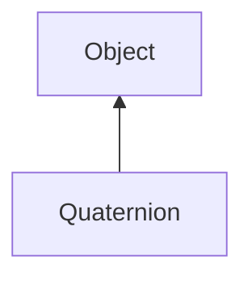

#### Inheritance Graph

## Functions

|
| -----------------------------------------------------------------------------------------------------------------------------------: | --------------------------------------------------------------------------------------- | 
| **\***(p0)                                                                                                                           | [ESMF] E_Quaternion E_Quaternion.\*(number)                                             | 
| **\*=**(p0)                                                                                                                          | [ESMF] E_Quaternion E_Quaternion.\*=(Number)                                            | 
| **/**(p0)                                                                                                                            | [ESMF] E_Quaternion E_Quaternion./(number)                                              | 
| **/=**(p0)                                                                                                                           | [ESMF] E_Quaternion E_Quaternion./=(Number)                                             | 
| **_constructor**([p0 [, p1 [, p2 [, p3]]]])                                                                                          | [ESMF] Quaternion new Quaternion([ x,y,z,w \| Quaternion \| Mat3x3\|  Array(x,y,z,w) ]) | 
| **[conjugate](classGeometry_1_1%5F%5FQuaternion#classGeometry_1_1%5F%5FQuaternion_1a69a106d902daf558f28a06dd74852f64)**()            | [ESMF] E_Quaternion E_Quaternion.conjugate()                                            | 
| **[dot](classGeometry_1_1%5F%5FQuaternion#classGeometry_1_1%5F%5FQuaternion_1a3ffafd4548c7ea37f636a266e4ee1e57)**(p0)                | [ESMF] Number E_Quaternion.dot(Quaternion)                                              | 
| **[eulerToQuaternion](classGeometry_1_1%5F%5FQuaternion#classGeometry_1_1%5F%5FQuaternion_1affc72d280cc57429e084772ed3897deb)**(p0)  | [ESF] (static) E_Quaternion eulerToQuaternion(Vec3)                                     | 
| **getW**()                                                                                                                           | [ESMF] number E_Quaternion.getW()                                                       | 
| **getX**()                                                                                                                           | [ESMF] number E_Quaternion.getX()                                                       | 
| **getY**()                                                                                                                           | [ESMF] number E_Quaternion.getY()                                                       | 
| **getZ**()                                                                                                                           | [ESMF] number E_Quaternion.getZ()                                                       | 
| **[inverse](classGeometry_1_1%5F%5FQuaternion#classGeometry_1_1%5F%5FQuaternion_1a3ab46c41d8f2adbe7f6e77c9542df503)**()              | [ESMF] E_Quaternion E_Quaternion.inverse()                                              | 
| **[length](classGeometry_1_1%5F%5FQuaternion#classGeometry_1_1%5F%5FQuaternion_1a29f66755b3ab5c7373aba42b9e710e00)**()               | [ESMF] number E_Quaternion.length()                                                     | 
| **[lerp](classGeometry_1_1%5F%5FQuaternion#classGeometry_1_1%5F%5FQuaternion_1a4700237d38a731fc97546618ebf8eb4c)**(p0, p1, p2)       | [ESF] (static) E_Quaternion lerp(Quaternion, Quaternion, float)                         | 
| **makeRotate**(p0, p1 [, p2 [, p3]])                                                                                                 | [ESMF] self E_Quaternion.makeRotate(deg, (Vec3 axis \| x,y,z) )                         | 
| **[matrixToQuaternion](classGeometry_1_1%5F%5FQuaternion#classGeometry_1_1%5F%5FQuaternion_1ae11ae5714634ca99a3070bbcaed76343)**(p0) | [ESF] (static) E_Quaternion matrixToQuaternion(Matrix3x3)                               | 
| **[normalize](classGeometry_1_1%5F%5FQuaternion#classGeometry_1_1%5F%5FQuaternion_1a608fe1ef674572f5b3fa89cc940b2a9b)**()            | [ESMF] self E_Quaternion.normalize()                                                    | 
| **setW**(p0)                                                                                                                         | [ESMF] self E_Quaternion.setW(Number)                                                   | 
| **setX**(p0)                                                                                                                         | [ESMF] self E_Quaternion.setX(Number)                                                   | 
| **setY**(p0)                                                                                                                         | [ESMF] self E_Quaternion.setY(Number)                                                   | 
| **setZ**(p0)                                                                                                                         | [ESMF] self E_Quaternion.setZ(Number)                                                   | 
| **[slerp](classGeometry_1_1%5F%5FQuaternion#classGeometry_1_1%5F%5FQuaternion_1a0fd9280764f33bd72142cee6c689646d)**(p0, p1, p2)      | [ESF] (static) E_Quaternion slerp(Quaternion, Quaternion, float)                        | 
| **toArray**()                                                                                                                        | [ESMF] Array E_Quaternion.toArray()                                                     | 
| **[toEuler](classGeometry_1_1%5F%5FQuaternion#classGeometry_1_1%5F%5FQuaternion_1aa40d0b7198c2bbfd20937632a3613167)**()              | [ESMF] E_Vec3 E_Quaternion.toEuler()                                                    | 
| **[toMatrix](classGeometry_1_1%5F%5FQuaternion#classGeometry_1_1%5F%5FQuaternion_1a362accd377e6eea512d83ad951eb4729)**()             | [ESMF] E_Matrix3x3 E_Quaternion.toMatrix()                                              | 
{: .nohead .nowrap1 }

