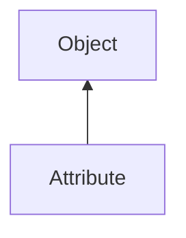

#### Inheritance Graph

## Functions

|
| -----------------------------------------------------------------------------------------------------------------: | ------------------------------------- | 
| **[empty](classUtil_1_1AttributeFormat#classUtil_1_1AttributeFormat_1a8480392eaa0500657e896afb7f3ca0da)**()        | Bool VertexAttribute.empty()          | 
| **[getDataSize](classUtil_1_1AttributeFormat#classUtil_1_1AttributeFormat_1a189ee6212843ad789d47162041d61443)**()  | Number VertexAttribute.getDataSize()  | 
| **[getDataType](classUtil_1_1AttributeFormat#classUtil_1_1AttributeFormat_1ab87a27bfae3306c61e7883b7ce7bac74)**()  | Number VertexAttribute.getDataType()  | 
| **[getName](classUtil_1_1AttributeFormat#classUtil_1_1AttributeFormat_1a80353849b6fdea1aaf84aa21253bdde5)**()      | String VertexAttribute.getName()      | 
| **getNormalize**()                                                                                                 | Bool VertexAttribute.getNormalize()   | 
| **[getNumValues](classUtil_1_1AttributeFormat#classUtil_1_1AttributeFormat_1a14e321deef7eb22b5fc176f97894fbf6)**() | Number VertexAttribute.getNumValues() | 
| **[getOffset](classUtil_1_1AttributeFormat#classUtil_1_1AttributeFormat_1a9d1e6d4a336912c0b2b3325600c684c0)**()    | Number VertexAttribute.getOffset()    | 
| **[isNormalized](classUtil_1_1AttributeFormat#classUtil_1_1AttributeFormat_1ac429ea174281b29ca4e9adf50046f337)**() |                                       | 
{: .nohead .nowrap1 }

