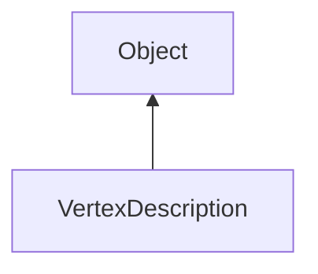

#### Inheritance Graph

## Functions

|
| -------------------------------------------------------------------------------------------------------------------------------------------------------------: | ------------------------------------------------------------------------------------------------------------------------------------------------------------------------------- | 
| **_constructor**()                                                                                                                                             | VertexDescription new VertexDescription()                                                                                                                                       | 
| **[appendAttribute](classUtil_1_1ResourceFormat#classUtil_1_1ResourceFormat_1a6760644ae2b1bf8377555ae2672e7954)**(p0, p1, p2, p3)                              | Attribute VertexDescription.appendAttribute(String name, Number type, Number numValues, Bool normalize) \note only string constants can be used.                            | 
| **[appendColorRGBAByte](classRendering_1_1VertexDescription#classRendering_1_1VertexDescription_1aa78ac4d97a936d8cececeacdeffbc8cd)**()                        | thisEObj VertexDescription.appendColorRGBAByte()                                                                                                                                | 
| **[appendColorRGBAFloat](classRendering_1_1VertexDescription#classRendering_1_1VertexDescription_1a8b7f7ca9bb0d4012ce943d33a5043ea0)**()                       | thisEObj VertexDescription.appendColorRGBAFloat()                                                                                                                               | 
| **[appendColorRGBFloat](classRendering_1_1VertexDescription#classRendering_1_1VertexDescription_1a13faf70f60726a4984b6f3245df05abd)**()                        | thisEObj VertexDescription.appendColorRGBFloat()                                                                                                                                | 
| **[appendFloatAttribute](classRendering_1_1VertexDescription#classRendering_1_1VertexDescription_1a815feecc17ff4cc3433cc5e4a68179be)**(p0 [, p1])              | Attribute VertexDescription.appendFloatAttribute(String name, Number numValues) \note only string constants can be used.                                                    | 
| **[appendNormalByte](classRendering_1_1VertexDescription#classRendering_1_1VertexDescription_1a5db419ee16f5861e35daeb35608e05b8)**()                           | thisEObj VertexDescription.appendNormalByte()                                                                                                                                   | 
| **[appendNormalFloat](classRendering_1_1VertexDescription#classRendering_1_1VertexDescription_1a48ab40631b421120e86c0f3b5e13071a)**()                          | thisEObj VertexDescription.appendNormalFloat()                                                                                                                                  | 
| **[appendPosition2D](classRendering_1_1VertexDescription#classRendering_1_1VertexDescription_1aa0ccbef636f49fd4925d45d24490a36a)**()                           | thisEObj VertexDescription.appendPosition2D()                                                                                                                                   | 
| **[appendPosition3D](classRendering_1_1VertexDescription#classRendering_1_1VertexDescription_1a4ad8a757ea2b391d5798263bd94f4540)**()                           | thisEObj VertexDescription.appendPosition3D()                                                                                                                                   | 
| **[appendPosition4D](classRendering_1_1VertexDescription#classRendering_1_1VertexDescription_1a443e8790c98515af74528a57abcd8b19)**()                           | thisEObj VertexDescription.appendPosition4D()                                                                                                                                   | 
| **[appendPosition4DHalf](classRendering_1_1VertexDescription#classRendering_1_1VertexDescription_1a071ec8ce1d2bb9db0fa00e99af9a62d7)**()                       | thisEObj VertexDescription.appendPosition4DHalf()                                                                                                                               | 
| **[appendTexCoord](classRendering_1_1VertexDescription#classRendering_1_1VertexDescription_1a8a13a4e844cd6baea513d550339d295c)**([p0])                         | thisEObj VertexDescription.appendTexCoord()                                                                                                                                     | 
| **[appendUnsignedIntAttribute](classRendering_1_1VertexDescription#classRendering_1_1VertexDescription_1a1c71dea67408030860e6d92f5f1bbf86)**(p0 [, p1 [, p2]]) | Attribute VertexDescription.appendUnsignedIntAttribute(String name, Number numValues) \note only string constants can be used.                                              | 
| **[getAttribute](classUtil_1_1ResourceFormat#classUtil_1_1ResourceFormat_1a605b726096243999687e274a47609329)**(p0)                                             | Attribute \| Void VertexDescription.getAttribute(String name) \note only string constants can be used. \note the result type may be different to the c++ version (void) | 
| **[getAttributes](classUtil_1_1ResourceFormat#classUtil_1_1ResourceFormat_1a62b2f6e1cf8ae7bca8919e5027cfb1ad)**()                                              | Array VertexDescription.getAttributes()                                                                                                                                         | 
| **[getNumAttributes](classUtil_1_1ResourceFormat#classUtil_1_1ResourceFormat_1aad8358aff8ba1beeb64fd570fd36bc7f)**()                                           | Number VertexDescription.getNumAttributes()                                                                                                                                     | 
| **[getVertexSize](classRendering_1_1VertexDescription#classRendering_1_1VertexDescription_1a51da17571ce4cc8852ed3a28e3771ca5)**()                              | Number VertexDescription.getVertexSize()                                                                                                                                        | 
| **[hasAttribute](classUtil_1_1ResourceFormat#classUtil_1_1ResourceFormat_1a98f47236bedc7160bf06c55fb8b3d808)**(p0)                                             | Bool VertexDescription.hasAttribute(String name)                                                                                                                                | 
{: .nohead .nowrap1 }

