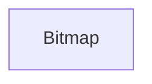

#### Inheritance Graph

## Types

|
| ---- | --------------------------------------------------------------- | 
| type | [Util.Bitmap.PixelFormat](escript_type_Util_Bitmap_PixelFormat) | 
{: .nohead }

## Attributes

|
| -------------------------------------------------------------------------------------------------------------: | -- | 
| **[BGR](namespaceUtil_1_1PixelFormat#namespaceUtil_1_1PixelFormat_1abd6c3797d19d812df014f68c8966ef54)**        |  | 
| **[BGRA](namespaceUtil_1_1PixelFormat#namespaceUtil_1_1PixelFormat_1aa34bc0ebdf86b3e23819a8fe87dae0fc)**       |  | 
| **[BGRA_FLOAT](namespaceUtil_1_1PixelFormat#namespaceUtil_1_1PixelFormat_1a99607862ca39e204e3862942372ccb26)** |  | 
| **[BGR_FLOAT](namespaceUtil_1_1PixelFormat#namespaceUtil_1_1PixelFormat_1a034818628c7df4e47f56530409f5d363)**  |  | 
| **[MONO](namespaceUtil_1_1PixelFormat#namespaceUtil_1_1PixelFormat_1afb8d134d44b3c480c557d0c9e5b753d6)**       |  | 
| **[MONO_FLOAT](namespaceUtil_1_1PixelFormat#namespaceUtil_1_1PixelFormat_1a11658f247a2bcf6166d9ed85c14ffb9a)** |  | 
| **[RGB](namespaceUtil_1_1PixelFormat#namespaceUtil_1_1PixelFormat_1ac14b3594bce341166442134e67ffb3de)**        |  | 
| **[RGBA](namespaceUtil_1_1PixelFormat#namespaceUtil_1_1PixelFormat_1a6d4311cdbf4c4b3b8cd727033dc5430a)**       |  | 
| **[RGBA_FLOAT](namespaceUtil_1_1PixelFormat#namespaceUtil_1_1PixelFormat_1a0db82fefba431b4d77fbde58dd6cdb75)** |  | 
| **[RGB_FLOAT](namespaceUtil_1_1PixelFormat#namespaceUtil_1_1PixelFormat_1af6e259cb3015875926f7d0870bbad2b4)**  |  | 
| **[UNKNOWN](namespaceUtil_1_1PixelFormat#namespaceUtil_1_1PixelFormat_1ac34abaccb17f366483dcbfd36da31c73)**    |  | 
{: .nohead .nowrap1 }

## Functions

|
| -------------------------------------------------------------------------------------------------: | ---------------------------------------------------------- | 
| **_constructor**(p0, p1, p2)                                                                       | [ESF] Bitmap new Bitmap(width,height,E_PixelFormat format) | 
| **[flipVertically](classUtil_1_1Bitmap#classUtil_1_1Bitmap_1a3af22beac82453ac68b193f5f0be3ceb)**() | [ESMF] thisObj Bitmap.flipVertically()                     | 
{: .nohead .nowrap1 }

