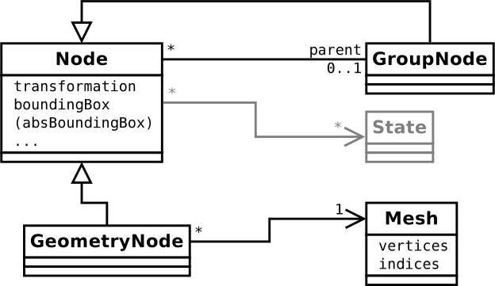

## MinSG - A Minimalist Scene Graph
MinSG stands for minimal scene graph and represents the scene graph of PADrend.
Even it is stated to be minimal MinSG is very powerful.
The graph can be created by different nodes.
This tutorial concentrates on two node types and gives a simple example of creating a scene by using MinSG.

## Node class hierarchy

The base class of scene graph nodes is called _Node_.
It provides method that are common for all type of nodes.
For this tutorial we also need object of the class _ListNode_.
They are used as the inner nodes of the scene graph.
List nodes contain a list of child nodes.
Nodes can be added and removed dynamically.
The class of last type of nodes we need is _GeometryNode_.
A geometry node is capable of holding a mesh which is displayed when the node is traversed by the renderer.
Geometry nodes are leaf nodes in the scene graph.
In the following you will the most important methods of the different nodes.
