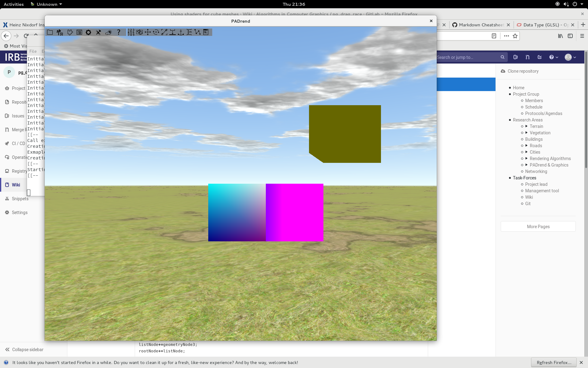

<script src="mermaid.js"></script>
<script>mermaid.initialize({startOnLoad:true});</script>
In this tutorial a scene Graph is made by loading cube meshes from the same file. The color and the position of the one cube is static as loaded from the file. The color of the second cube is dynamic depending on the position of the camera. The third cube goes up as the viewer goes far away from the cube and down as the viewer approaches to it. These changing of color and position is done by writing GLSL and using shaders. The structure of the scene graph is:

```mermaid
graph TD;
    rootNode:ListNode-->listNode:ListNode;
    listNode:ListNode-->geometryNode1:GeometryNode;
    geometryNode1:GeometryNode-->staticColoredCube;
    listNode:ListNode-->geometryNode2:GeometryNode;
    geometryNode2:GeometryNode-->changeColor:ShaderState;
    geometryNode2:GeometryNode-->dynamicColoredCube;
    listNode:ListNode-->geometryNode3:GeometryNode;
    geometryNode3:GeometryNode-->moveUpandDown:ShaderState;
    geometryNode3:GeometryNode-->movingCube;    
```

The above scene graph with EScript script

```javascript
var rootNode=new MinSG.ListNode();
var listNode=new MinSG.ListNode();
var cube1=Rendering.loadMesh("./data/mesh/color_cube.mmf");
var geometryNode1=new MinSG.GeometryNode(cube1);
listNode+=geometryNode1;
geometryNode1.moveLocal(new Geometry.Vec3(1, 0, 0));
var cube2=Rendering.loadMesh("./data/mesh/color_cube.mmf");
var geometryNode2=new MinSG.GeometryNode(cube2);
geometryNode2.moveLocal(new Geometry.Vec3(2, 0, 0));
var cube3=Rendering.loadMesh("./data/mesh/color_cube.mmf");
var geometryNode3=new MinSG.GeometryNode(cube3);
geometryNode3.moveLocal(new Geometry.Vec3(3, 0, 0));
listNode+=geometryNode2;
listNode+=geometryNode3;
rootNode+=listNode;
```
But the cubes have static color and position. Shaders are passed as states to the inner nodes of the scene graph. There is a changeColor and a moveUpandDown state of type shaderState(see structure graph above). The first changes the color of the second cube as the camera moves. The latter moves up the third cube as the viewer away and down as the viewer aproaches. Shaders are written in GLSL. GLSL code is stored in variables as string of characters.

The changeColor shader state

```javascript
var vertexShaderCode="
varying vec4 vetxColor;

void main()
{
    //coordinate of the vertex in projection space
    vec4 pos = ftransform();
    gl_Position = pos;
    vetxColor = pos;

}
";


var fragmentShaderCode="
varying vec4 vetxColor;

void main()
{
    gl_FragColor = vetxColor;
} ";


var shader = Rendering.Shader.createShader(vertexShaderCode, fragmentShaderCode);
var changeColor = new MinSG.ShaderState(shader);
geometryNode2+=changeColor;

```
The moveUpandDown shader state

```javascript
var vertexShaderCodeTranslate="
varying vec4 vetxColor;

void main()
{

    mat4 translateMatrix=mat4(1,0,0,0,
      0,1,0,0.5,
      0,0,1,0,
      0,0,0,1);
    //fransform represents
    //coordinate of the vertex in projection space
    vec4 pos = ftransform()*translateMatrix;
    gl_Position = pos;
    vetxColor = vec4(0.4,0.4,0,0);

}
";

var shader2 = Rendering.Shader.createShader(vertexShaderCodeTranslate, fragmentShaderCode);
var moveUpandDown = new MinSG.ShaderState(shader2);
geometryNode3+=moveUpandDown;
```


Finally, register and the scene as the current scene
```javascript
PADrend.registerScene(rootNode);
PADrend.selectScene(rootNode);
```


For the purpose of the tutorial mesh file color_cube.mmf is used
